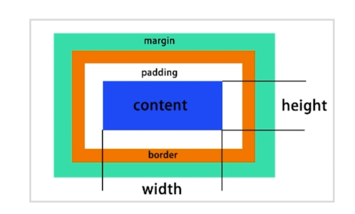

## 选择器

#### 解析方式

```css
.body div .hello{
    color: red;
}
浏览器从后往前解析，先找到 hello，验证它有没有父 div，再找 body 
```

#### 分类

- 元素选择器 a{}
- 伪元素选择器 ::before{}
- 类选择器(class) .link{}
- 属性选择器 [type=radio]{}
- 伪类选择器(状态) :hover{}
- id 选择器 #id{}
- 组合选择器 [type=checkbox] + label{}
- 否定选择器 not(.link){}
- *{}

#### 权重

权重数字不进位：防止多个类选择器权重高于 id 选择器

- id 选择器    +100
- 类选择器    +10
- 元素选择器 伪元素选择器    +1
- 其他    +0

#### 其他权重

- !important 优先级最高
- 元素属性优先级高(写在 html 里)
- 相同权重，后定义的生效

#### 伪类与伪元素

CSS3 中使用 : 来表示伪类，:: 来表示伪元素。

伪类表示元素的状态，例如 :hover、:link。

伪元素匹配特殊的位置，例如 ::before、::after。


## 非布局样式

#### 字体相关

- 字体族

  serif(衬线) sans-serif monospace(等宽) fantasy

- 多字体 fallback

  指定字体找不到就往后找，针对每个字符

- 网络字体、自定义字体

- iconfont

  文字变图标

```css
.font1{
    font-familu: "PingFang SC", "Microsoft Yahei", monospace
}
// 自定义字体
@fibt-face {
    font-family: "IF";
    src: url("./IndieFlower.ttf");
}
.custom-font{
    font-family: IF;
}
```

#### 行高

- 行高的构成

  line-box 决定了行高、最大的 inline-box 决定了 line-box 的高度。line-height 不会改变 inline-box 的高度，而是会影响最终的 line-box 的高度

- 行高相关的现象和解决方法

- 行高的调整

- 垂直对齐 - 行内元素

  ```css
  vertical-align: top, middle, buttom; // 
  ```

- 图片下面有空隙

  默认对齐是按照字体的 base-line，base-line 和底部是有距离

  1、vertical-align: buttom;

  2、display:block; 改为块级元素，不再按照字体来对齐

#### 背景

**颜色**

```css
hsl(0,100%,50%) 色度、饱和度、亮度
hsla(0,100%,50%,50%) 色度、饱和度、亮度、透明度
background: linear-gradient(to right/90deg, red, green) 渐变，方向或角度
background渐变+多背景叠加能够实现很多效果
```

**背景图**

```css
{
    height:100px;
    background: url(./1.png);
    background-repeat: no-repeat;
    background-position: center;
    background-position: 10px;
    background-size: 100px 50px;
}
```

**雪碧图**

将多个图片合并为一个，减少 http 请求

显示时只显示图片的一部分，通过设置 width、height、background-position 来确定大小和位置。

background-size 设置背景图的大小，background-size 变化 background-position 也要变化。

适配移动端时，一个像素对应屏幕上多个像素。需要缩小 background-size

```css
{
    width:100px;
    height:100px;
    background: url(./1.png);
    background-repeat: no-repeat;
    background-position: -10px -30px;
}
```

 **base64**

减少 http 请求，但会增大体积、解码。

#### 边框

边框属性：宽度、线型、颜色

边框背景图

```css
border-image: url(./1.png) 20 repeat
border-image: url(./1.png) 20 round
```

边框衔接

边框衔接部分是斜切的，所以可以实现三角形等形状

```css
{
    width: 400px;
    height: 200px;
    border-bottom: 30px solid red;
    border-right: 30px solid transparent;
    border-left: 30px solid transparent;
}
```

#### 滚动

over-flow

- auto 超出时自动存在滚动条
- scroll 始终显示滚动条
- visible 超出部分直接显示
- hidden 超出部分不显示

#### 文字折行(换行)

- overflow-wrap(word-wrap) 通用换行控制

  是否保留单词，单词中间会不会断

- word-break

  设置保留的单位，中文句子当做单词

- white-space

  no-wrap 不换行

  空白处是否断行

#### 装饰性属性

- 字重 font-weight
- 斜体 font-style:itatic
- 下划线 text-decoration
- 指针 cursor

#### CSS Hack

兼容性

在一部分浏览器上生效的方法l

```html
<body>
    <div class="checkbox">
        <input type="checkbox" id="handsome"/>
        <label for="handsome">我很帅</label>
    </div>
</body>
<style>
    .checkbox{

    }
    .checkbox input{
        display: none;
    }
    .checkbox input + label{
        background:url(./checkbox1.png) left center no-repeat;
        background-size:20px 20px;
        padding-left:20px;
    }
    .checkbox input:checked + label{
        background-image:url(./checkbox2.png);
    }
</style>
```

#### filter

css 的滤镜属性,可以给元素加一层滤镜

## 布局

常用方法

- table 表格布局
- float 浮动 + margin 布局
- inline-block 布局
- flexbox

#### 表格布局

可以用表格，也可以用 div 来模拟一个表格

```css
.table{
    display: table;
    width: 500px;
    hright:200px;
}
.table-row{
    display: table-row;
}
.table-cell{
    display: table-cell;
}
```

#### 盒模型



设置为 border-box 的元素指定的任何内边距和边框都将在已设定的宽度和高度内进行绘制。

#### display / position

- display：block/inline/inline-block

- position: 

  - static

    按照文档流来

  - relative

    偏移是按照元素本身来的，不会改变它占据的空间，原来占用的就是空白了，别的元素不会补齐

  - absolute

    相对于 body，不会影响文档流，不会影响别的元素，脱离的文档流

    也可能相对于最近的父级 relative 或 absolute。一直往上找，如果父级都不是 relative 或 absolute，那就是 body

  - fixed

    相对于可视区域固定

#### z-index

relative absolute fixed 可以设置 z-index。

### flexbox 布局

display: flex;

- 弹性盒子
- 盒子本来就是并列的
- 指定宽度就可以

```css
.container{
    width: 800px;
    height:200px;
    display: flex;
}
.left{
    background: red;
    display: flex;
    width: 200px;
}
.right{
    background: blue;
    display: flex;
    flex: 1; // 弹性布局
}
```

## float 布局

- 元素 浮动
- 元素脱离文档流，但不脱离文本流

文本会围绕在 float 元素周围

#### 对自身的影响：

- 形成了 块 (BFC)：可以设置宽高，自己接管宽高
- 位置尽量靠先上
- 位置尽量再靠左或右(看设置的是 right 还是 left)

#### 对兄弟元素的影响

- 上面贴着非 float 元素
- 旁边贴 float 元素
- 不影响其他块级元素
- 影响其他块级元素的内部文本

#### 对父级元素影响

- 从布局上消失

- 高度塌陷

  - 清除浮动

    浮动的元素不占父元素布局空间，可能会超出父元素，对其他元素造成影响 
  
    ```css
    .container::after{
        content: 'aaa';
        clear:both;
        display: block; 
        visibility: hidden;
        height:0;
  }
    ```
  
  - 设置父元素 over-flow:auto(hidden)

#### 布局

两栏布局

```html
<!DOCTYPE html>
<head>
    <style>
        .container{
            width: 800px;
            height: 400px;
        }
        .left{
            float: left;
            background-color: red;
            width: 200px;
            height: 100%;
        }
        .right{
            background: blue;
            height: 100%;
            margin-left:200px; 左边流出位置，方便控制内容
        }
    </style>
</head>
<body>
    <div class="container">
        <div class="left"></div>
        <div class="right">右</div>
    </div>
</body>

```

三栏布局

```html
<!DOCTYPE html>
<head>
    <style>
        .container{
            width: 800px;
            height: 400px;
        }
        .left{
            float: left;
            background-color: red;
            width: 200px;
            height: 100%;
        }
        .right{
            background: blue;
            height: 80%;
            float: right;
            width: 200px;
        }
        .middle{
            margin-left: 200px; 左右都留出位置
            margin-right: 200px;
        }
    </style>
</head>
<body>
    <div class="container">
        <div class="left"></div>
        <div class="right">右</div> # 右栏放在前面是因为中间一栏会先占用，右栏就会被挤下去
        <div class="middle">中间</div>
    </div>
</body>
```

## inline-block

- 像文本一样排 block 元素
- 没有清除浮动等问题
- 需要去除间隙
- 很难做自适应

```css
<!DOCTYPE html>
<head>
    <style>
        .container{
            width: 800px;
            height: 400px;
        }
        .left{
            display: inline-block;
            width: 200px;
            height: 400px;
            background-color: red;
        }
        .right{
            display: inline-block;
            width: 600px;
            height: 400px;
            background-color: blue;
        }
    </style>
</head>
<body>
    <div class="container">
        <div class="left">左</div><div class="right">右</div>
    </div>
</body>
```

## 响应式设计和布局

在不同设备上正常使用，一般处理屏幕大小的问题

主要方式：

- 隐藏 + 折行 + 自适应空间
- rem / viewport / media query

#### 加 viewport

```html
<meta name="viewport" content="width=device-width", initial-scale=1.0>
```

#### 隐藏侧边栏

```css
@media (max-width:640px){
    .left{ 
        display: none;
    }
}
```

#### 固定 viewport 的 width 来实现不同设备等比例放大

```html
<meta name="viewport" content="width=320", initial-scale=1.0>
```

#### rem 设置动态大小：

html 元素有一个 font-size 值默认为 16px，那么 1rem = 16px。这个值也可以自己设置，并且可以配合 @media 来操作。

缺点：不是特别精确

```css
.left{
    width: 5rem;
}
```

## 效果属性

#### box-shadow

投影，可以用来画各种图形。

充当没有宽度的边框(不占空间)

#### text-shadow

文本投影。立体感、印刷品质 

#### border-radius

计算会加上边框，所以 50% 比较好

- 圆角矩形
- 圆形
- 半圆 / 扇形

#### background

动画效果，利用雪碧图来实现

```css
.i{
    width: 20px;
    height: 20px;
    background: url(./background.png) no-repeat;
    background-size: 20px 40px;
    transition: background-position .4s;
}
.i: hover{
    background-position: 0 -20px;
}
```

保持缩放填充或填满

```css
background-size: contain(cover)
```

#### clip-path

对容器进行裁剪，支持多边形

但是容器的占位不变

用来做容器内的动画比较方便

基本什么效果都能用他实现

#### 2D 变换

- translate
- scale
- skew
- rotate

```css
.cube{
    transform: translateX(100px) rotate(25deg) # 变换是有顺序的，不能随便交换
}
```

#### 3D 变换

transform 只是元素样式的变换，和动画没有必然关系 。

性能不是很好，复杂场景下回出现渲染问题

#### 题目：

- 如何用一个 div 画。。。。

- 如何产生不占空间的边框

- 背景图 居中、不重复、改变大小

- 如何实现 3D 效果

  perspective: 500px;

  transform-style: preserve-3d;

  transform: translate 

## CSS 动画

作用：

- 掩饰
- 观感
- 引起注意
- 传递信息(例如密码错误时摇晃)

#### transition 补间动画

只有起始状态和最终状态，中间的动画是自动补出来的

```html
<!DOCTYPE html>
<head>
    <meta charset="UTF-8">
    <style>
        .container{
            width: 100px;
            height: 100px;
            background-color: red;
            transition: width .4s, background 1s;
            transition-delay: .4s;
            transition-timing-function: ease-in-out;
        }
        .container:hover{
            width: 500px;
            background-color: green;
        }
    </style>
</head>
<body>
    <div class="container"></div>
</body>
```

- transition-timing-function

  缓动效果，可以指定动的快慢，例如开头结尾快，中间慢。可以在很多网站设置曲线。

- transition: width .4s, background 1s;

  前面是动的对象，后面是动画时长

- transition-delay: .4s;

  延迟多久开始动画

#### keyframe 关键帧动画

中间的动画还是补出来的，但是可以不只设置起始和最终，还可设置中间状态。

- 相当与多个补间动画。
- 与元素的状态无关，不用再修改元素的属性。例如 hover 后改变颜色。

```css
.container{
    width: 100px;
    height: 100px;
    background-color: red;
    animation: run 1s;
    /* animation-direction: reverse 播放方向 */
    /* animation-fill-mode: forward 最后停留在动画终止的状态 */
    /* animation-play-state: paused 动画暂停 */
    /* animation-iteration-count: infinite 播放次数 */
}
@keyframes run {
    0%{
        width: 100px;
    }
    50%{
        width: 300px;
    }
    100%{
        width: 800px;
    }

}
```

#### 逐帧动画

没有补的部分，其实还是关键帧动画。

适用于无法补间计算的动画。

资源消耗较大。

```css
.container{
    width: 100px;
    height: 100px;
    background-color: red;
    animation: run 1s;
    /* animation-timing-function: steps(1) 关键帧之间有几个画面 */
}
```

#### 补间动画

- 平移
- 旋转
- 缩放
- 透明度
- 线性变换

#### 题目

- 过渡动画和关键帧动画区别

- 如何实现逐帧动画

- CSS 动画性能

  1. 性能不差

  2. 部分情况下好于 JS

  3. JS 可以做到更好

  4. 部分高危属性

     box-shadow


# CSS预处理器

- 基于 CSS 的另一种语言
- 通过编译工具编译为原始 CSS 例如 babel
- 常见为 less sass

#### 功能增强

- 嵌套 能够反映层级和约束
- 变量和计算 能够减少重复代码
- Extend 和 Mixin 代码片段
- 循环语法
- import css 文件模块化

## 预处理器框架

- SASS - Compass
- Less - Lesshat / EST
- 提供现成的 mixin
- 类似 js 的库

```less
@import "est/all" // 用了什么 mixin 就会编译出什么 所以直接 import all 就行
@support-ie-version: 7;
.global-reset();
.box{
    .inline-block();
    .opacity(60)
}
.left{
    float:left;
    .clearfix();
}
.row{
    .make_row();
}
.my_triangle:after{
    .triangle(...)
}
```

## less

```js
npm install less
```

可以通过嵌套方式，& 就代表父元素。字体颜色等可以使用变量来复用

```less
@fontSize: 12px;
@bgColor: red;
.wrapper{
    background: lighten(@bgColor,40%);
    .nav{
        font-size: @fontSize;
    }
    &:hover{
        background: @bgColor;
    }
}
```

#### 代码复用 Mixin

以前的操作

```html
<div class="class1 class2 class3" />
```

less 的 Mixin，用于 mixin 的类不加 () 就不会被编译出来

```less
@fontSize: 12px;
@bgColor: red;

.block(@fontSize){
    font-size: @fontSize;
    border: 1px;
}
.wrapper{
    .block(@fontSize)
    .nav:extend(.block){}
}
```

#### 循环

```less
.gen-col(@n) when (@n > 0){
    .gen-col(@n - 1);
    .col-@{n}{
        width: 100px/12*@n
    }
}
.gen-col(12);
```

#### 模块化

直接 import 就行，预处理器会编译为一个文件

```less
@import "./index1"
@import "./index2"
@import "./index3"
```

## Sass

```
npm install node-sass
```

代码结构和 less 几乎一样，变量定义与 less 不同，@改为$。

```scss
$fontSize: 12px;
$bgColor: red;
.wrapper{
    background: lighten($bgColor,40%);
    .nav{
        font-size: $fontSize;
    }
    &:hover{
        background: $bgColor;
    }
}
```

```scss
@minxin block($v){
    font-size: $v;
}
.wrapper{
    @include block('12px')
}
```

# React 中的 CSS

- 官方没有集成方案
- 只能使用社区方案
  - css modules 在 className 中引入样式
  - react-css-modules
  - styled components 带样式的组件
  - styled jsx 在 jsx 中写样式

#### styled components 

```react
import styled from 'styled-components'
const DIV = styled.div`
	color:red
	${(props)=>props.big&&`font-size:72px;`}
`
render() {
    return (
    	<DIV big>Hello<DIV/>
    )
}
```

## Bootstrap

- CSS 框架
- twitter

主要提供功能

- 基础样式
- 常用组件
- JS 插件