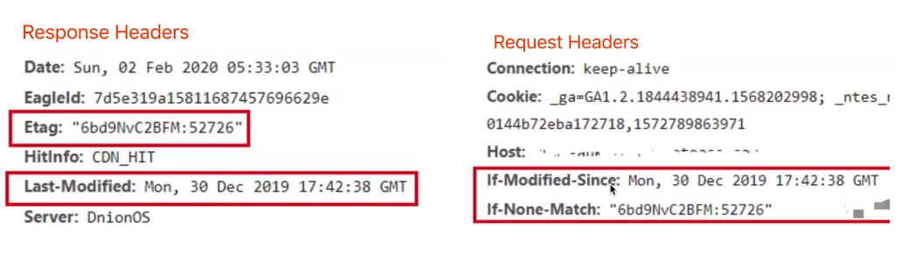
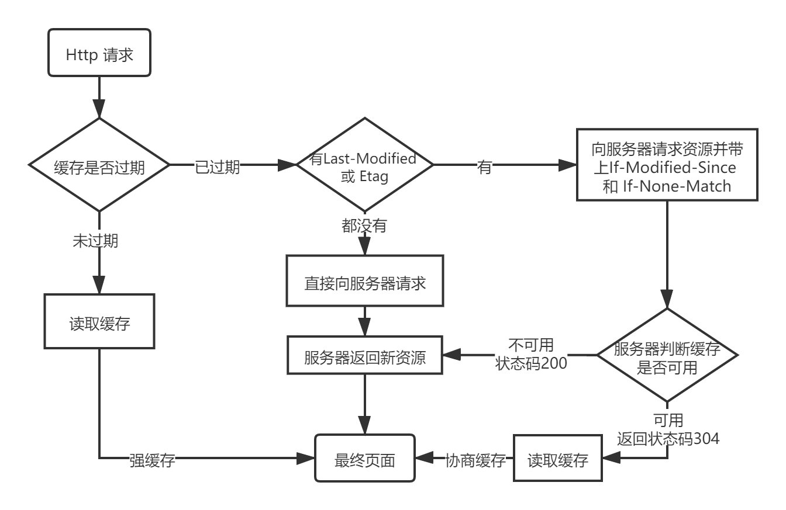

## 状态码

#### HTTP 常见状态码

- 1** 表示服务器收到请求，需要请求者继续执行操作
- 2** 表示成功，操作成功接受并处理
- 3** 重定向，需要进一步操作完成请求。301,302：临时重定向，永久重定向 304：资源未被修改
- 4** 客户端错误，请求有语法错误或无法完成请求 403：没有权限 404：资源未找到
- 5** 服务端错误 504：网关超时

本质是一种规范

## 方法

- 获取：GET
- 新建：POST
- 更新：PUT/PATCH
- 删除：DELETE

## Restful API

- 传统 API 设计：把 url 当做一个功能
- Restful API设计：把 url 当做一个唯一的资源

#### Restful 如何设计

- 尽量不用 url 参数
传统：/api/list?page=2
Restful：/api/list/2
- 用 method 表示操作类型
  **传统：**
  post：/api/create-blog
  post：/api/update-blog?id=100 
  get：/api/get-blog?id=100
  **Restful：**
  post：/api/blog
  patch：/api/blog/100
  get：/api/blog/100

## HTTP Headers

#### Request Headers

- accept：浏览器可接收的数据格式
- accept-encoding：浏览器可接收的压缩算法，如 gzip
- accept-Language：浏览器可接收的语言，如 zh-CN
- Connection： 长连接
- cookie
- host
- user-agent
- content-type：发送数据的格式

#### Response Headers

- content-type 返回数据的格式
- content-length 返回的数据大小，多少字节
- content-encoding 数据的压缩算法
- set-cookie

## HTTP 缓存

把没有必要重新获取的东西先缓存下来，同时加快访问速度。网络请求是瓶颈。

一般缓存静态资源。(例如 webpack 中的 hash)

#### 强制缓存

**cache-control**

- 在 Redponse Header 中
- 控制强制缓存
- 例 Cache-Control: max-age=31536000 (秒)

缓存后再次请求就可以直接在本地寻找（失效前）

**Cache-Control 值：**

- max-age
- no-cache 不用本地缓存，可能用服务端的缓存
- no-store 不用本地缓存，也不用服务端的缓存措施
- private 只允许最终用户缓存
- public 代理服务器也可以缓存

#### Expires

被 cache-control 代替

#### 协商缓存(对比缓存)

服务端缓存策略(不是缓存在服务端)，服务端判断一个资源能不能用缓存的内容

若缓存资源与服务端资源一样，返回 304。否则返回 200 和新资源。

Last-Modified 机制：浏览器先请求并获取资源与资源标识。再次请求就直接发送缓存的资源标识和 If-Modified-Since(值为Last-Modified)，服务端来判断能否使用缓存。

Etag 机制：浏览器先请求并获取资源与资源标识。再次请求就直接发送缓存的资源标识和 If-None-Match(值为Etag)，服务端来判断能否使用缓存。

**资源标识**

response header中

- Last-Modified 资源最后修改时间
- Etag 资源唯一标识

Last-Modified 与 Etag 可以共存

- 优先使用Etag
- Last-Modified 只能精确到秒
- 若资源重复生成，则内容不变，Etag也不变

## 刷新操作

正常操作：强制缓存有效，协商缓存有效

F5 刷新：强制缓存失效，协商缓存有效

强制刷新：强制缓存失效，协商缓存失效