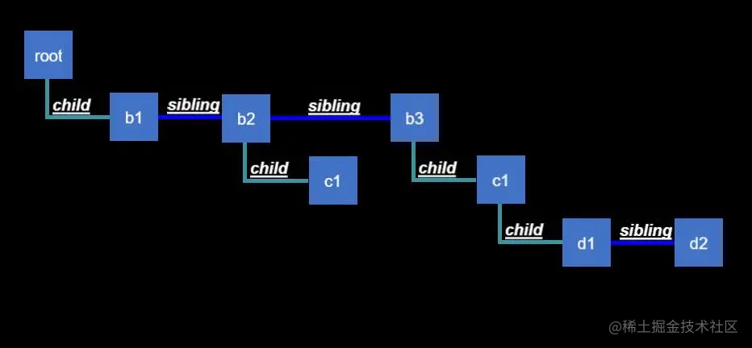
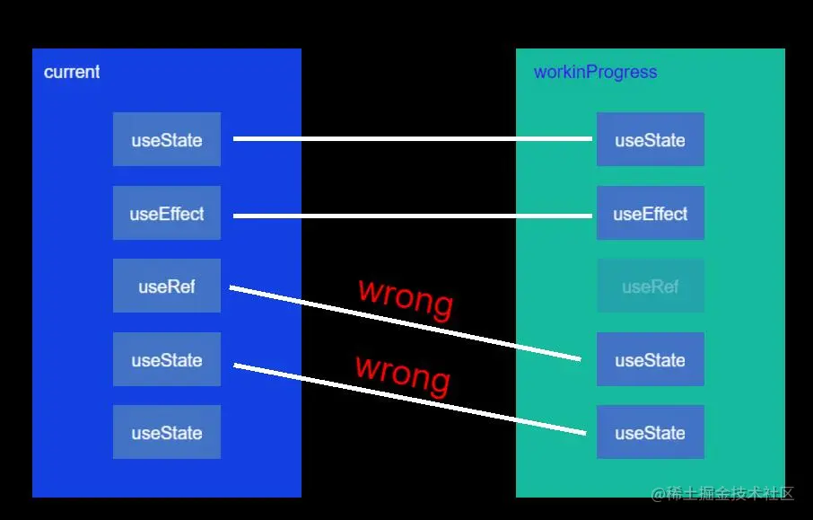

# Mixin

## Mixin 的坏处

#### 隐式的依赖关系很难追踪

例如组件里用了 mixin 的方法, mixin 又调用了组件里的方法,js 又是动态语言,很难去执行或者记录这些依赖.

#### mixin 使得方法变得不安全

例如一个纯函数就是安全的。假如你写了一个有状态的组件，在 mixin 中去读取了它的状态.然后你想将状态提升到父组件来共享给其他子组件，你通常会忘了去修改 mixin。

这就容易让新人很难修改代码，例如组件的某一个方法可能调用了 mixin 中的，mixin 又可以指定自己的 mixin。而且 mixin 之间的关系是扁平的，没有像 component 这种层次结构，很难判断数据在 mixin 中的流向。

#### mixin 的命名冲突

例如一个 mixin 中有 handleChange 则你就不能使用含有同样方法的其他 mixin，并且你也不能在 component 中定义这个方法。有时候可以直接修改，有时候其他的 mixin 调用了 就得去全部修改，有时候是第三方的 mixin，那就只能用别的名字来定义方法。

当项目变得复杂，向 mixin 中添加方法也非常困难，你不知道这个名字在组件中有没有被使用。

重构的风险太大导致垃圾代码没法被修改。

#### 复杂性提升

随着需求的增加，mixin 会变得更加复杂，使用相同 mixin 的组件的耦合程度也更高，每一个新功能都会通过 mixin 添加到所有的组件上，没法把 mixin 中简单的部分提取出来，并且 mixin 天生就没法很好地适应变化的需求。

## Mixin 的解决方案

#### HOC

高阶组件。HOC 只是一种设计模式。只是一个函数接受一个 component 作为参数，返回一个封装好的 component。

但是 HOC 会遇到 ref 丢失的问题，即你获得的 ref 是外层包装组件的 ref 而不是内层目标组件的。此时需要使用 forwardRef 来进行转发。

#### render 逻辑的复用

全部改成组件的形式

# Context

主要场景是不同层级的组件需要使用同一个数据，但是使用 props 来层层传递会显得非常冗余，并且一旦需要新加属性就需要每个中间组件都加上。

## 替代方案-组件组合的方式

例如直接将组件自身传递下去。这样中间的组件就不必知道它是怎么工作的，组件有变化时也无需逐个修改。

但是这会使得高层次的组件变得复杂，并且也需要层层传递。而且有时候会有很多组件都使用同一个属性，这种方案就需要传递很多组件下去。

## Context

```react
const MyContext = React.createContext(defaultValue);
<MyContext.Provider value={/* 某个值 */}>
</MyContext.Provider>
```

context 值改变时传递不会被 SCU 所打断，能够传递给所有 consumer 组件。

#### Class 组件中的使用

```react
const context1 = React.createContext(defaultValue)
// 方法1
class Component1 extends React.Component {
    conponentDidMount(){
        const value = this.context // 这里只能订阅单一的context
    }
}
Component1.contextType = context1

// 方法2
class MyClass extends React.Component {
  static contextType = MyContext;
  render() {
    let value = this.context; // 这里只能订阅单一的context
  }
}

// 在函数式组件中使用, render props 的模式
<context1.Consumer>
    {value => <div>value</div>}
</context1.Consumer>

// 动态 context
class App extends React.Component {
  render() {
    // 在 ThemeProvider 内部的 ThemedButton 按钮组件使用 state 中的 theme 值，
    // 而外部的组件使用默认的 theme 值
    return (
      <>
        <ThemeContext.Provider value={this.state.theme}>
          <Toolbar changeTheme={this.toggleTheme} />
        </ThemeContext.Provider>
        <ThemedButton />
      </>
    );
  }
}

// 更新 context 值
const context2 = React.createContext({
  theme:1,
  toggleTheme:()={}
})
class App extends React.Component {
  constructor(){
      this.toggle = () =>{
          this.setState(state=>{
              theme: state.theme+1
          })
      }
      this.state ={
          theme:1,
          toggleTheme: this.toggle
      }
  }
  render() {
    return (
      <>
        <context2.Provider value={this.state}>
          <ThemedButton />
        </context2.Provider>
      </>
    );
  }
}
function ThemedButton() {
  return (
    <ThemeContext.Consumer>
      {({theme, toggleTheme}) => ()}
    </ThemeContext.Consumer>
  );
}
```

#### Context 的问题

因为 context 通过浅比较来判断是否重新渲染,但是内联的属性在每次渲染都会重新生成，为防止这种情况可以将 value 提升到 state 中。

```react
<MyContext.Provider value={{something: 'something'}}></MyContext.Provider>
<MyContext.Provider value={this.state.value}></MyContext.Provider>
```

#### Hook 中的使用

```react

```

# Concurrent Mode

现在不再是一个 Mode，因为它并不是全局生效的，而是可以用一个 transition 来包裹来决定要不要用 Concurrent ，更多的是 Concurrent Rendering，并发渲染。当 React 在长时间更新状态时就不会阻塞浏览器。类似于在后台跑 setState() 。

可以使用 Transition 的方式 wrap 含有 setState 的操作来启动不并发渲染。

#### React Lane

使用 bitmask 运算来判断 setState 的优先级，然后 react 根据优先级来决定先执行哪些渲染。

# Server Component

Server Component 的想法就是把组件放到服务器上运行，因为服务器之间通信是很快的，所以多次网络请求也开销不大。

初衷是想解决两个问题：

- 能不能不做性能优化就有不错的性能
- 数据请求其实有不少顾虑，例如一般都是在顶层请求数据后分发到各个组件，就导致每个组件的数据源其实并不清晰，但是瀑布式的请求又会有性能问题。

优势：

- Server Component 的相关代码不会给客户端，SSR 会吧所有的组件代码都给客户端
- Server Component 只在服务端执行，而 SSR 服务端只在加载页面的时候执行一次。
- 可以在任意位置访问后端，SSR 只能是页面级的渲染。
- 能够保留交互的状态，因为客户端拿到的是 Server Component 的渲染结果，客户端在拿到结果后可以 merge 到已渲染好的组件上。
- 可以减少最终打包的体积
- 自动按需加载
- 它的格式是自定的格式，比 HTML 能传递的信息更丰富得多

这些优势其实都是放在服务器上运行之后反推出来的，而不是最开始就想解决的。

在 Server Component 中，它们分成了 Server Component，Client Component 和 Shared Component。主要是为了提供更多选择，而不是增加复杂度。理想的话只要在文件名加上 .server.js 就可以启动 server component 了。

# React 与 Vue 的区别

vue 主要在探索基于 mutable 的基础上能做什么，而 react 更专注于 immutable 的基础上能做什么。vue 更倾向于做一些妥协与折衷，也更关注能不能去解决实际的问题。比如它会提供一些人们呼声很高的功能，包括更加便利的动画，更加便利的条件渲染、组件模板等等。而 react 倾向于把功能做好了再添加上去，而不是为了便利性添加一堆功能。

# Fiber

React **Fiber** 是 React16 之后新出的协调引擎，它主要是使得 VDom 可以进行**增量式渲染**。

所谓**调停**或者协调指的是当一个组件的 props 或者 state 改变时 React 会重新创建一个新的 vdom 和旧的 vdom 进行对比，来决定有没有必要更新真实的 dom，当它们不同时才会更新 dom。

但是 vdom diff 的过程是无法中断的，所以会一直阻塞页面的主线程，导致页面卡顿的问题。Fiber 就是为了解决这个问题。

Fiber 的核心 api 是 **requestIdleCallback**，当浏览器空闲时会执行 requestIdleCallback 中的回调。Fiber 在这个 api 的基础上把 diff 操作拆分成了一系列小任务，使得在浏览区需要渲染时把线程的控制权还给浏览器，来保证浏览器的渲染。

- 暂停/恢复
- 根据优先级来处理不同的任务
- 重复使用之前完成的工作
- 不需要计算的话就停止

## 原理

首先任务被分了优先级，高优先级的任务能够打断低优先级任务的执行。

Fiber 分为两个阶段

在这两个阶段中，阶段二，也就是 dom 更新的阶段是不能拆分的，因为会导致某些时刻 dom 的状态和 内部维护的 vdom 的状态不一致，这个是必须要同步的，因为 vdom 还要用在不同的平台上，改了这个会增加大量的逻辑，并且并没有给性能带来很大提升。并且 dom 的拆分更新可能会导致页面抖动。

阶段一的拆分只能按节点来拆，因为按别的来拆(组件、工序)都会会导致时间消耗不一样。

#### 阶段一

生成 Fiber 树，diff 后得出需要更新的节点，这个过程是增量式的，可以被打断。

首次渲染时会生成一个 Fiber 树。Fiber 树是在 vdom 基础上生成的链式结构。



Fiber 树会在首次渲染的时候生成一次，后续需要 diff 的时候，会根据已有的树和最新的 Vdom 来生成新的树。

以现有的 fiber tree，从 root 开始逐个构造 **workinProgess tree**：

1. 判断当前节点需不需要更新，不需要的话跳到5，要更新的话打个 tag
2. 更新当前节点
3. 调用 scu
4. 调用 render()
5. 如果没有子节点，那么此次工作结束，把 effect list 归并到 return中，将下一个兄弟节点作为下一个工作，有子节点则子节点为下一个工作
6. 如果没有剩余时间了或者有优先级更高的工作，则等下一次空闲再开始，否则就继续
7. 没有剩下的工作了，准备 dom 更新。

在新树的生成过程中每生成一个节点都会将控制权还给浏览器，如果没有更高优先级的任务，则继续构建。

如果有更高优先级的任务，则丢弃正在生成的树，在空闲的时候再执行一遍。

#### 阶段二

将需要更新的节点进行更新，这个过程不能被打断。

#### 总结

fiber 从代码上来看可以说是做了一件递归改循环的事

#### 为什么不能在 if 中使用 hook？

因为在每次构建 workinprogress fiber 时，都会沿用 current fiber 的节点以及其中的 hook 信息，达到复用的目的。而 hook 是以链表的结构存储的，所以它们就是按顺序延续的，如果其中一个 hook 突然消失，那么它们的对应关系就乱了。



#### Hook 为什么必须是顺序调用

先看看除了顺序调用还有其他哪些方案：

- 限制只有一个 useState

  因为只有一个，所以不会有顺序调用的问题。但是就没法使用 custom hook 了。

- 接受一个唯一的 key 来标识 hook

  可能会出现命名冲突

- 使用 symbol 来解决命名冲突

  调用两次 custom hook 的话这两个用的还是同一个 key

- 多层继承问题

  其实和上一个问题一样，如果多个 自定义 hook 内部又使用了同一个 自定义hook，那么这种情况会导致这个父 hook 被复用了。

- 把 symbol 包在闭包里，这样每次都会生成一个新的 symbol

  增加心智负担，每次心增一个 hook 都要重新命名一个 symbol，使用 hook 要多一个步骤

- 

- 

# Class 组件和 Function 组件最大的区别

**函数组件捕获了渲染所用的值。**

React 虽然是以 immutable 为基础，但是 class 组件的一个问题就是它的 this 是不变的。虽然 this.state 和 this.props 是 immutable，但是 this 始终是这个 this，这也就导致了不管在 class 组件的哪个地方，你获取的永远是最新的，过于新的 props。

Function 组件的特点就是接收的 props 和本身的 state 都是真正的不可变的，利用闭包的特性，这个 state 和 props 都是渲染时那一刻的值，这种方式是更符合直觉的。但会引来新的问题就是闭包陷阱的问题。

##### 组件状态

- 从一整个 state 打散为一个个的元数据，各自独立管理
- 使用自定义 hook 来提供逻辑复用，代替 HOC。(HOC 模式的数据来源不直观)

# useEffect

更新过程:

- react 渲染新的 state
- 浏览器绘制
- 清除上一次的 effect，也就是运行上一次的 return 的内容
- 运行这一次的 effect。 

它的主要作用是根据 props 和 state 来同步 React tree 以外的东西。

#### 如何解决闭包陷阱的问题

```javascript
// 第一种，传入回调，避免闭包的变量污染下一次计算,setState 不会被闭包影响
const function = (props)=>{
    const [count, setCount] = useState(0)
    useEffect(()=>{
        const intervalid = setInterval(()=>{
            setCount(c=> c+1)
        })
        return ()=>{
            clearInterval(intervalid)
        }
    },[])
}
// 第二种，使用 useReducer，dispatch 在组件的生命周期里保持不变
function Counter(props) {
  const [count, dispatch] = useReducer(reducer, 0);

  function reducer(state, action) {
    if (action.type === 'tick') {
      return state + 1;
    } else {
      throw new Error();
    }
  }

  useEffect(() => {
    const id = setInterval(() => {
      dispatch({ type: 'tick' });
    }, 1000);
    return () => clearInterval(id);
      //这里其实不用加到依赖，但因为它是静态的，加了也没事
  }, [dispatch]);

  return <h1>{count}</h1>;
}
```


# 前端工程化

#### 模块化

ES6 Module 的出现使得 js 具备了模块化的能力，虽然之前社区里也有模块化的方案，但是统一的方案出了以后大家就都用统一方案了，因为不用额外引入别的代码。

模块化还包括 CSS 的模块化，例如 Less Sass 等，主要是解决类名冲突的问题，并且具备了更高的灵活度，例如可以计算样式，样式复用等。

#### 组件化

把可复用的逻辑拆分出来成为一个通用的组件，提升代码的可复用性和开发效率。也出现了很多组件库例如 Element，Ant Design等。其中 Ant Design Pro 又对业务做了一层封装，

#### 自动化

使用 Webpack 自动实现了代码打包、压缩、静态资源处理，加上辅助性的 plugin 和 loader，使得前端的开发更加自由。再结合 Babel，前端可以写随意高版本的 js 语法，打包时自动编译成低版本的 js，使得代码可读性、可维护性、开发效率大大提升。

CI/CD 持续集成、持续交付、持续部署，持续集成主要是在代码合并的时候自动构建应用并进行一些测试，包括单元测试和集成测试，如果测试不同过，就合并失败。这样可以在每一次提交都验证提交的代码而不是最后一天统一合并后由开发人员再去验证。

持续交付指的是在代码合并并验证通过后自动构建并把构建结构房放到代码库中。

持续部署指的是持续交付后直接把构建结果发布到生产环境。

#### 跨端

一开始主要是 Hybrid 的方案，也就是在 app 里套个 webview，本质上还是浏览器浏览页面，但是需要做 webView 和 app 之间的通信。

**React Native** 的出现利用了 React Vdom 和真实 Dom 分离的特性，用 Vdom 映射到 app 的 UI，通过 Bridge 调用原生 API。Vue 也有类似的 weex，原理类似。但是 React Native app 有运行速度慢，打包体积大等问题。

**小程序**的出现更多的是商业上的考量，各个大公司都想把生态放在自己的 app 里。并且开发者也可以通过这个平台来降低推广成本。但是小程序可以借助微信调用一些webview无法调用的系统 api。

