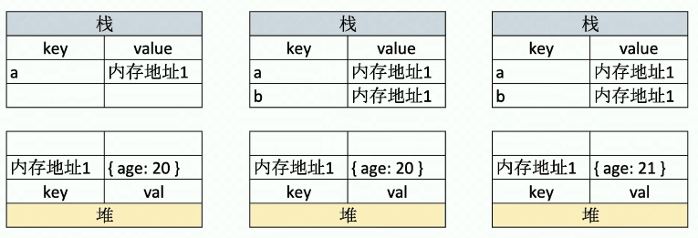
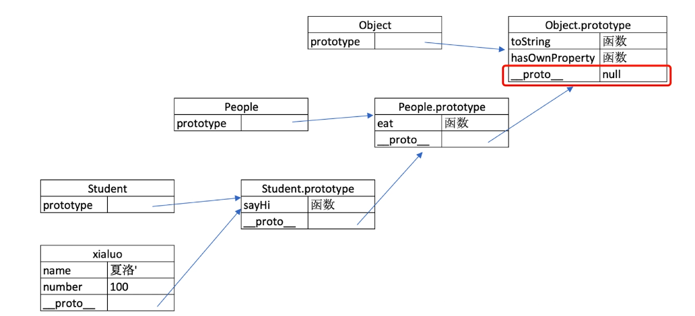

# JS 基础

## 值类型&引用类型

值类型：赋值给其他变量，修改其中一个不会同步变换。(相互独立)

引用类型：赋值给其他，修改其中一个会同步变换。(其实还是同一个对象)

#### 本质

值类型直接在栈中存储**值**，引用类型在栈中存储对象的**内存地址**。



#### 原因

出于性能考虑。值类型通常不大，可以直接复制，而引用类型通常较大，直接存储不好管理，所有都直接复制会影响性能。

#### 具体

##### 常见值类型：undefined，string，number，bool，symbol

##### 常见引用类型：object，list，null，function

## typeof

- 识别所有值类型
- 识别函数(function)
- 判断是否为引用类型(object)，null 也是 object
- 深拷贝
  - 深拷贝还可以使用 JSON.stringify + JSON.parse() 的方式，
  - 但是这种方式拷贝 undefined、function 等类型会丢失
  - 并且如果里面有时间的话会变成时间戳。
  - 如果里面有构造函数的话也会消失。
  - 里面有 NaN 会变成 null

```javascript
function deepClone(obj = {}){
    if (typeof obj !== 'object' || obj == null){
        return obj
    }
    let result
    if (obj instanceof Array){
        result = []
    } else {
        result = {}
    }
    for (key in obj){
        if(obj.hasOwnProperty(key)){
            result[key] = deepClone(obj[key])
        }
    }
    return result
}

```

```javascript
function deepClone(obj){
    if(typeof obj !== 'object'|| typeof obj == null){
        return obj
    }
    let result
    if(obj instanceof Array){
        result = []
    }else{
        result = {}
    }
    for (key in obj){
        if(obj.hasOwnProperty(key)){
            result[key] = deepClone(obj[key])
        }
    }
    return result
}
```


## 类型转换

### == 与 ===

只在 ==null 时使用 ==

```javascript
a == null 相当于 a === null || a === undefined
```

### if判断与逻辑运算

#### truly 变量& falsely 变量

通过 !! 判断

```javascript
!!0  		false
!!NaN 		false
!!'' 		false
!!null 		false
!!undefined false
!!false 	false
```

## 原型&原型链

js是基于原型继承的语言

### class

```javascript
class player{
    constructor(nickname, id){
        this.nickname = nickname
        this.id = id
    }
    login(){
        if(this.nickname&&this.id){
            console.log('sucess')
        } else{
            console.log('missing nickname or id')
        }
    }
    hello(){
        console.log(`${this.name},${this.id}`)
    }
}
p1 = new player('09'， 9) // new 会经过 constructor
```

#### instanceof

顺着隐式原型往上寻找

```javascript
vip instanceof superplayer	true
vip instanceof player		true
vip instanceof object		true
```

### 原型

在定义 class 时，每个 class 都有一个 prototype(显示原型)，它指向一个原型对象。同时这个类生成的每个实例也有一个 `__proto__`(隐式原型)指向同一个对象。

#### 基于原型执行规则

一个实例获取属性或方法时，先在自身属性和方法寻找，找不到再去`__proto__`中寻找。

### 原型链

每个 class 有一个 prototype(显示原型)，它指向一个显示原型对象。这个显示原型对象也有一个 `__proto__`指向它的父类的显示原型。



### 手写 jQuery，考虑扩展性

```javascript
class jQuery{
    constructor(selector){
        const result = document.querySelectorAll(selector)
        const length = result.length
        for(let i = 0; i<length; i++){
            this[i] = result[i]
        }
        this.length = length
    }
    // 获取第几个元素
    get(index){
        return this[index]
    }
    // 遍历
    each(fn){
        for (let i = 0; i < this.length; i++){
            const elem = this[i]
            fn(elem)
        }
    }
    // 监听
    on(type, fn) {
        return this.each(elem =>{
            elem.addEventListener(type, fn, false)
        })   
    }
}
// 插件机制
jQuery.prototype.dialog = function (params) {
    alert(params)    
}
// 复写机制
class myjQuery extends jQuery {
    constructor(selector){
        super(selector)
    }
    addClass(classname) {   
    }
}

```

## 继承

#### 原型链继承

```javascript
function Person(){}
function Student(){}
Student.prototype = new Person()
```

原型链继承缺点：

- 当父类的属性为引用类型时，会存在不同实例共享属性的问题。

  使用构造函数继承来解决

#### 构造函数继承

```javascript
function Person(){
    this.hobbies = ['bb', 'yoyo']
}
function Student(){
    Person.call(this)
}
```

构造函数继承缺点:

- 由于函数也是引用类型，所以所有实例的函数也是不同享的，所以每个实例都有一个重复的函数。导致代码重复

  使用组合继承来解决

#### 组合继承

```javascript
function Person(){
    this.hobbies = ['bb', 'yoyo']
}
Person.prototype.log = function(){
    console.log('haha')
}
function Student(){
    Person.call(this)
}
Student.prototype = new Person()
```

#### 原型式继承

```javascript
function clone(proto){
    function F(){}
    F.prototype = proto
    return new F()
}
```

原型式继承与原型继承其实类似，但是函数接收的可以不是构造函数。那就相当于浅复制了。

#### 寄生式继承

```javascript
class superplayer extends player{
    constructor(nickname, id, level){
        super(nickname) //把nickname给player的constructor处理
        super(id)		//把id给player的constructor处理
        this.level = level
    }
    kill(){
        console.log('kill a ailen')
    }
}
vip = new superplayer('01', 1, 999)
```

## 作用域&闭包

作用域是一个变量的使用范围。

- 全局作用域
- 函数作用域
- 块级作用域

```javascript
if (true) {
	let a = 1	//if、for的{}之中就是块
}
console.log(a) //报错
```

#### 自由变量

指一个变量在当前作用域没有定义但被使用了。会向上级作用域一层一层寻找，直至找到。只要找到就不继续寻找。

### 闭包

作用域的特殊情况：

- 函数作为参数传递
- 函数作为返回值被返回

闭包指自由变量的查找是在函数定义的地方向上级作用域进行查找而不是在函数执行的地方。

```javascript
// 函数作为返回值
function create() {
    let a = 100
    return function () {
        console.log(a)
    } 
}
let f = create()
let a = 200
f()
------------------->输出100
// 函数作为参数传递
function print(fn) {
    let a = 200
    fn()
}
let a = 100
function fn() {
    console.log(a)
}
print(fn)
------------------->输出100
```

#### 闭包的应用：

隐藏数据，只提供接口

```javascript
function jj() {
    let data = {}
    return {
        set: function(key, value) {
            data[key] = value
        },
        get: function(key) {
            return data[key]
        }
    }
}
let jj1 = jj()
jj1.set('xm', 'sb')
console.log(jj1.get('xm'))
```

### this

使用场景：

- 作为普通函数					返回window
- 使用 call apply bind         传入的值
- 对象方法调用                     对象本身
- 在class方法中被调用        实例本身
- 箭头函数                            上级作用域的this

this 在各个场景中的取值是在执行的时候确定的。

new 会改变 this 指向，首先new关键字会创建一个空的对象，然后会自动调用一个函数apply方法，将this指向这个空对象。

### bind

`bind()` 方法创建一个新的函数，在 `bind()` 被调用时，这个新函数的 `this` 被指定为 `bind()` 的第一个参数，而其余参数将作为新函数的参数，供调用时使用。

- 创建一个函数，不论怎么调用，这个函数都有同样的 **`this`** 值。

- 使一个函数拥有预设的初始参数。

- 使用 [`window.setTimeout()`](https://developer.mozilla.org/zh-CN/docs/Web/API/Window/setTimeout) 时，`this` 关键字会指向 [`window`](https://developer.mozilla.org/zh-CN/docs/Web/API/Window) （或 `global`）对象。当类的方法中需要 `this` 指向类的实例时，可以把 `this` 绑定到回调函数。

  ```javascript
  LateBloomer.prototype.bloom = function() {
    window.setTimeout(this.declare.bind(this), 1000);
  };
  ```

### call

`call()` 方法使用一个指定的 `this` 值和单独给出的一个或多个参数来调用一个函数。

传入`this`后该函数内部调用的 `this` 就是传入的 `this` 。

- 使用 `call` 方法调用父构造函数
- 使用 `call` 方法定义函数中使用的 `this` 
- 使用 `call` 方法调用函数并且不指定第一个参数，`this` 的值将会被绑定为全局对象。在严格模式下是 undefined

#### call 与 apply 区别

`call()` 方法接受的是**一个参数列表**，而 `apply()` 方法接受的是**一个包含多个参数的数组**。

## 异步&单线程

异步基于 js 是原生单线程。JS 和 DOM 渲染共用同一个线程，因为 JS 可修改 DOM 结构。

异步基于 callback 函数形式

#### Promise

解决 callback hell 的问题

```javascript
// 手写 Promise
function loadImg(src){
    return new Promise(
        (resolve, reject) => {
            let img = document.createElement('img')
            img.onload = () => {
                resolve(img)
            }
            img.onerror = () => {
                reject(new Error('error'))
            }
            img.src = src
        }
    )
}


URL = 'https://edu-image.nosdn.127.net/3310f128e53b406f94400f7ae6046db2.png?imageView&quality=100'
URL2= 'https://s3.pstatp.com/toutiao/xitu_juejin_web/img/logo.a7995ad.svg'
loadImg(URL)
.then((img) => {
    console.log(...)
    return img
}).then(img=>{
    console.log(...)
	  return loadImg(URL2)
}).then(img2 => {
    console.log(...)
}).catch(err => {
    console.log(err)
})
```

# JS Web API

- DOM
- BOM
- 事件绑定
- ajax
- 存储

## DOM(Document Object Model)

框架封装了 DOM 操作。

DOM 是浏览器解析 html 代码后构建的树，然后再将 DOM 树渲染为网页。DOM 的存在是为了 js 能够操作网页。

#### Property

通过使用 js 属性的形式来改变页面样式。它修改 DOM 对象中的属性

```javascript
let p = document.getElementByID('div1')
p.style.width = '100px'
```

#### attribute

直接修改 html 属性

```javascript
p.setAttribute('style', 'font-size:  50px;')
p.getAttribute('style')
```

property 与 attribute 都会引起 DOM 重新渲染。

#### DOM 结构操作

```javascript
// 新建节点
let newP = document.createElement('p')
newP.innerHTML = 'newP'
// 插入节点
div1 = document.getElementByID('div1')
div1.appendChild(newP)
// 移动节点(对现有节点执行appendChild会移动节点)
let p1 = document.getElementByID('p1')
div1.appendChild(p1)
// 获取父元素
p1.parentNode
// 获取子元素
let childNodes = div1.childNodes
div1Child = Array.prototype.slice.call(div1.childNodes)
    .filter(child => {
    if(child.nodeType === 1){
        return true
    } 
    return false
})
// 删除子元素
div1.removeChild(childNodes[0])
```

#### DOM 性能

DOM 查询做缓存

将频繁操作改为一次操作 

#### DOM 离线操作

```javascript
// 1, 改变 display 属性，临时将某个元素从文档流中脱离，然后再恢复它
var ul = document.getElementById('list');
ul.style.display = 'none';
// 对 ul 进行操作
ul.style.display = 'block'

// 2, 通过 createDocumentFragment，创建文档片段，操作后一次性把文档片段添加到文档流中。
var fragment = document.createDocumentFragment()
// 在 fragment 上进行一系列操作
document.getElementById('list').appendChild(fragment)

// 3, 通过在需要操作的节点上创建副本，然后在副本上进行操作，最后进行替换
var ul = document.getElementById('list');
var clone = ul.cloneNode(true);
// 对 clone 节点进行操作
ul.parentNode.replaceChild(clone, ul);
```

## BOM(Browser Object Model)

#### 操作

识别浏览器类型

分析拆解 url 各个部分

#### 知识点

- **navigator**
  获取浏览器类型标识。例如apple的网站只能用标识为 safari 的浏览器打开。但是它只是一种标识，浏览器可以直接加多个标识来增加易用性。

  ```javascript
  navigator.userAgent
  // chrome 的标识
  // Mozilla/5.0 (Windows NT 10.0; Win64; x64) AppleWebKit/537.36 (KHTML, like Gecko) Chrome/84.0.4147.125 Safari/537.36
  ```

- screen

- **location**
  ```javascript
  location.href	// 网址
  location.protocol //http or https
  location.host //域名
  location.search //查询参数
  location.hash
  location.pathname
  ```
- history
  ```javascript
  history.back
  history.forward
  ```

## 事件
#### Issue

- 通用事件监听函数
- 事件冒泡流程
- 无限下拉的列表如何监听每个图片的点击

#### knowledge

- 事件绑定
```javascript
let btn = document.getElementById（'btn123'）
btn123.addEventListener('click', event => {
    console.log('clicked')
})
```
```javascript
function bindEvent(ele, type, f){
    ele.addEventListener(type, f)
}
bindEvent('btn1', 'click', event =>{
    console.log(event.target)
    event.preventDefault()
})
```
- 事件冒泡
  事件会在dom树中往上走，像冒泡一样

  ```javascript
  event.stopPropagation()  //阻止冒泡
  event.preventDefault()   //阻止默认行为
  event.target()		     //获取触发元素
  ```

- 事件代理
某些情况下，元素过多，无法依次绑定它的行为。那么就绑定在它的父元素上。在父元素上获取触发的元素，并进行逻辑判断等。
好处：代码简洁、在特殊情况下减少内存占用。不要滥用

#### 事件监听函数(考虑代理)

#### 当事件禁止冒泡时如何捕捉到事件

```javascript
temp1.addEventListener('mousedown',()=>{
    console.log('click')
},{ capture: true })
```

## 存储

#### cookie

本身只是用于浏览器和 server 通讯。是 http 请求头中的一个字段。但是可以用作本地存储，页面刷新 cookie 值不会清空。

```javascript
// cookie 赋值是追加操作，已有的话就会覆盖
document.cookie = "a=200"
```

缺点：

- 存储大小，最大4KB
- 每次 http 请求都会带上 cookie，增加请求的数据量
- api 简陋

#### localStorage 与 sessionStorage

- html5 专为存储设计，每个域名最大可存5M

- api： setItem getItem

- 不会在 http 请求中发送


#### localStorage 与 sessionStorage 区别

- localStorage 数据会永久存储，除非代码或手动删除
- sessionStorage 只存在于当前会话，浏览器关闭(标签页关闭)就清空

## XMLHttpRequest

#### GET

```javascript
const xhr = new XMLHttpRequest()
xhr.open("GET", url, true) // 此时还未发送请求 true为异步
xhr.onreadystatechange = function() {
    // 异步处理请求返回值
    if (xhr.readyState === 4){
        if(xhr.status === 200){
            console.log('success')
        } else {
            console.log('error')
        }      
    }
}
xhr.send(null)	// 发送请求
```

#### POST

```javascript
const xhr = new XMLHttpRequests()
xhr.open("POST", url, true)
xhr.onreadystatechange = function() {
    pass
}
let params = {
    name: "xxx",
    password: "sss"
}
xhr.send(JSON.stringify(params)) // 不能直接发送JSON对象
```

#### readyState

- 0 - 还未调用 send 方法
- 1 - 已调用 send 方法，正在发送请求
- 2 - send 方法执行完成，已收到所有响应内容
- 3 - 正在解析响应内容
- 4 - 响应内容解析完成，客户端可以调用

#### status

http 状态码

## 跨域

#### 同源策略

- ajax 请求，**浏览器**要求当前网页和 server 必须同源
- 协议、域名、端口一致是同源

#### 图片、css、js 无视同源

- img 可以使用第三方统计打点服务
- css js 可以使用 cdn 加速
- `<script>` 可实现 JSONP

跨域必须经过 server 允许配合

未经 server 允许就实现跨域说明浏览器存在漏洞

#### JSONP

访问一个域名并不代表返回 html 文件。服务端可以任意拼接数据，但要符合 html 格式。js 文件同理。

所以可以通过与服务端配合，使用  `<script>` 来获取跨域数据。

#### CORS

服务器设置 http header。

服务器设置后就可以不用考虑跨域问题，直接发送 ajax 请求。

#### JSON

key 必须用**双引号**

后端可以直接返回对象，就不需要 JSON 来转换。

# Performance API

它是一个高精度的时间 API，并且可以用来计算打开一个网页各个步骤的时间。

还可以获取用户行为信息，例如网页加载来源，经过了多少次重定向。

https://javascript.ruanyifeng.com/bom/performance.html

#### setInterval 缺点

setInterval 的原理是每隔一段时间将事件添加到事件队列里，所以可能会出现当前事件队列很长，结果好几个 setInterval 的事件挤在一起，然后依次执行了。就起不到隔一段时间执行的效果。

```javascript
function myInterval(fn, timeout){
    let timer ={
        flag: true;
    }
    function set(){
        if(timer.flag){
            fn()
            setTimeout(fn, timeout)
        }
    }
    setTimeout(fn, timeout)
    return timer
}
```

