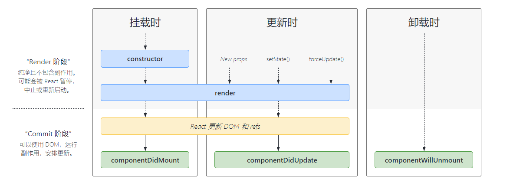

react DOM 实际上就是一个 react 在 web 端的渲染器

react native 就是一个 react 在移动端的渲染器

yarn eject 可以将 webpack 配置暴露出来，但是不建议使用。Stuff can break

vscode 中可以添加配置来调试 react 应用

## JSX

react 元素是不可变对象

JSX 会编译为一个 react.createElement 函数，然后返回一个对象

JSX 本质是一个复杂的对象

优势：

- 简化代码，提升效率
- 将 js 和 ui 结合起来，用 js 思维思考整个逻辑。

# React 使用

- 组件通讯
- JSX 本质
- context 是什么？ 用途？
- shouldComponentUpdate 的用途
- redux 单向数据流
- setState 是同步还是异步？

#### JSX基本使用

原生 html

```javascript
const rawHtml = '<div>Hellow</div>'
const rawHtmlData = {
    __html: rawHtml // 属性名前面需要__
}
// 富文本显示 dangerouslySetInnerHtml
const rawHtmlElem = '<div><b>Hellow</b></div>'
<p dangerouslySetInnerHtml={rawHtmlElem}/>
```

#### 条件判断

- 直接使用 if else
- 三元表达式
- &&
- ||

#### 渲染列表

- map
- key

```javascript
this.list.map((item, index)=>{
    // 和 vue 的 key 是同一个概念，必填，不能使 index 或 random
    return  <li key={item.id}>index {index}, title {item.title}</li>
})
```

## react 事件基础*

#### bind this

- 函数默认的 this 是 undefined，所以要使用 this.event.bind(this)。

```javascript
// 写在 constructor 里，这样 bind 就只会执行一次，写在 jsx 里就会重复执行
this.click = this.click.bind(this)
```

- 静态方法 - this 永远指向当前实例，其实就是箭头函数

#### event 参数

```javascript
clickHandler = (event) => {
    event.preventDefault() // 阻止默认行为
    event.stopPropagation() // 阻止冒泡
    console.log(event.target) // 指向当前元素
    console.log(event,currentTarget) // 其实并不是当前元素
    // event 并不是原生 event对象，原生的是 MouseEvent，Vue 里是原生的
    console.log(event)
    // 获取原生 event
    console.log(event.nativeEvent)
    console.log(event.nativeEvent.target) // 指向当前元素
    console.log(event.nativeEvent.currentTarget) // 指向 document
    // 这里的 event 是一个合成事件
    // 所有的事件都被挂载到 document 上
    // 和 DOM 事件不一样 和 Vue 事件也不一样
}
```

#### 传递自定义参数

```jsx
<div onClick={this.click.bind(this, param1, param2)}/>
click(id, title, event){
    // 最后会追加一个 event 参数
}
```

## 表单

#### 受控组件

react 没有实现 双向数据绑定

受控组件指表单里的值受 state 控制

非受控组件，表单里的值没法用过 state 控制

```jsx
const renderInfo = (
	<>
    	<p>{this.state.name}</p>
    	<label></label>
    	<input id="input" value={this.state.name} onChange={this.onInputChange}>
    </>
)
onInputChange = (e) => {
	this.setState({
        name: e.target.value
    })
}
```

## 父子组件通讯

- props 传递数据

  ```javascript
  this.props.Value // 直接通过 this.props 就能接受
  ```

- props 传递函数

  和传递数据一样，直接执行就行

- props 类型检查

  ```javascript
  Value.propTypes = {
      list: PropTypes.arrayOf(PropTypes.object).isRequired
  }
  ```

#### 状态提升

其实就是数据提升，就是把数据提到最高级的组件上，所有数据的操作都在父组件上。

## setState*

- 不可变值*
- 可能是异步更新
- 可能会被合并

#### 不可变值

1. 必须使用 setState 来改变 state 值
2. 必须使用一个新的值，不能影响之前的state

```javascript
let res = this.state.list5.slice() // 创建一个副本(深拷贝)
res.splice(2,0,'a')
this.setState({
    count:this.state.count + 1,
    list1:this.state.list1.concat(100), // concat 返回的是一个新数组
    list2:[...this.state.list2, 100], // 与上面相同，不过是 ES6 的新语法
    list3:this.state.list3.slice(1,5),
    list4:this.state.list4.filter(item=> item>100),
    list5:res // 比较复杂的操作时创建一个副本
})
// 对于对象
this.setState({
    obj1: Object.assign({}, this.state.obj1, {a:100}),
    obj2: {...this.state.obj2, a:100}
})
```

#### 同步 or 异步

```javascript
this.setState({
    count:this.state.count+1
}, () => {
    console.log(this.state.count) // 是最新值
})
console.log(this.state.count) // 不是最新值，因为是异步的

// 然而在 setTimeout 中是同步的
setTimeout(()=>{
	this.setState({
        count: this.state.count + 1
    })
    console.log(this.state.count) // 这里是最新值
},0)

// 在自定义的 DOM 事件里也是同步的
document.body.addEventListener('click', ()=>{
	this.setState({
        count: this.state.count + 1
    })
    console.log(this.state.count) // 这里是最新值
})
```

#### 合并

传入对象被合并。结果只执行一次。

```javascript
// 因为是异步的，所以就相当于执行了三次 this.setState({count:1})
this.setState({count:this.state.count + 1})
this.setState({count:this.state.count + 1})
this.setState({count:this.state.count + 1})
```

传入函数，不会进行合并

```javascript
this.setState((prevState, props)=> {
    return {
        count: prevState.count + 1
    }
})
this.setState((prevState, props)=> {
    return {
        count: prevState.count + 1
    }
})
this.setState((prevState, props)=> {
    return {
        count: prevState.count + 1
    }
})
```

## 组件生命周期



# 高级特性

- 函数组件
- 非受控组件
- Portals
- context
- 异步组件
- 性能优化
- 高级组件 HOC
- Render Props

#### 函数组件

过去，当只接受 props 然后显示时就使用函数组件。

现在，推荐函数组件和 HOOK 结合，替代原来的 class 组件

#### 非受控组件

- ref
- defaultValue defaultChecked
- 手动操作 DOM 元素

一些必须使用 DOM 操作的功能，setState 实现不了

```jsx
constructor() {
    this.fileInputRef = React.createRef()
}
alertFile = () =>{
    const elem = this.filetInputRef.current
    alert(elem.files[0].name)
}
render() {
    return (
    	<div>
        	<input type="file" ref={this.fileInputRef}/>
            <botton onClick={this.alertFile}>alert</botton>
        </div>
    )
}
```

#### Portals

- 组件默认会按照既定的层次嵌套渲染
- 但是如何让组件渲染到父组件之外,例如渲染到 body 下

场景

- 父组件 overflow: hidden
- 父组件 z-index 值太小
- fixed 需要放在 body 第一层

```jsx
render(){
    return ReactDOM.createPortal(
    	<div className="modal">{this.props.children}</div>,
        document.body
    )
}
```

#### context

- 公共信息传递给每个组件
- 用 props 来传递就会太麻烦
- 用 redux 就太臃肿

```jsx
// 创建 context 并给一个默认值
const ThemeContext = React.createContext('light')

function ThemeLink (props) {
    // const theme = this.context // 会报错。函数式组件没有实例，即没有 this
    // 函数式组件可以使用 Consumer
    return <ThemeContext.Consumer>
        { value => <p>link's theme is {value}</p> }
    </ThemeContext.Consumer>
}

class ThemedButton extends React.Component {
    // 指定 contextType 读取当前的 theme context。
    // static contextType = ThemeContext // 也可以用 ThemedButton.contextType = ThemeContext
    render() {
        const theme = this.context // React 会往上找到最近的 theme Provider，然后使用它的值。
        return <div>
            <p>button's theme is {theme}</p>
        </div>
    }
}
ThemedButton.contextType = ThemeContext // 指定 contextType 读取当前的 theme context。

// 中间的组件再也不必指明往下传递 theme 了。
function Toolbar(props) {
    return (
        <div>
            <ThemedButton />
            <ThemeLink />
        </div>
    )
}

class App extends React.Component {
    constructor(props) {
        super(props)
        this.state = {
            theme: 'light'
        }
    }
    render() {
        return 
        <ThemeContext.Provider value={this.state.theme}>
            <Toolbar />
            <hr/>
            <button onClick={this.changeTheme}>change theme</button>
        </ThemeContext.Provider>
    }
    changeTheme = () => {
        this.setState({
            theme: this.state.theme === 'light' ? 'dark' : 'light'
        })
    }
}

export default App

```

#### 异步组件

组件较大或路由懒加载时使用

- import()
- React.lazy
- React.Suspense 等待时显示的内容

```jsx
const asyncComponent = React.lazy(() => import('./asyncComponent'))

class App extends React.Component {
    constructor(props){
        super(props)
    }
    render(){
        return (
        	<div>
                <React.Suspense fallback={<div>Loading...</div>}>
                    <asyncComponent/>
                </React.Suspense>
            </div>
        )
    }
}
```

# 性能优化

- 性能优化相对于 vue 来说，对于 react 更加重要
- setState 不可变值*

主要方向

- shouldComponentUpdate
- PureComponent 和 React.memo
- 不可变值 immutable.js

## SCU

##### React 中默认只要父组件有更新，所有子组件都会更新并重新渲染，不管传递的参数有无变化。

```javascript
shouldComponentUpdate(nextProps, nextState){
    if(this.props.value === nextProps.value){
        return false
    }
    if(isEqual(this.props.value,nextProps.value)) return false
    return true
}
```

##### 如果此时没有遵循不可变值的原则，那么 SCU 就会失效，因为引用类型本质就是同一个值，再怎么比较都是一样的。

##### 在 SCU 中尽量不要使用深度比较，深度比较会一次性递归到底，比较耗费性能

##### 有性能问题时再使用 SCU

## PureCompnent & memo

- PureCompnent 实现了浅比较
- memo 和 PureCompnent 一样，memo 用于函数式组件
- 浅比较已经适用于大部分情况

```javascript
function MyComponent(props){
    
}
function areEqual(prevProps, nextProps){
    
}
export default React.memo(MyComponent,areEqual)
```

## immutable.js

- 彻底拥抱不可变值
- 基于共享数据(不是深拷贝)，速度更快
- 有一定的学习和迁移成本

```javascript
const map1 = Immutable.Map({a:1,b:2,c:3})
const map2 = map1.set('b', 50)
map1.get('b') // 2
map2.get('b') // 50
```

# 公共逻辑抽离

- mixin 已被 react 弃用

- 高阶组件 HOC

  模式简单，但是会增加组件层级，props 透传时可能会出现 props 覆盖的问题

- Render Props

  代码简洁，理解难度更高

## HOC

高阶组件不是一种功能，而是一种模式

```javascript
const HOCFactory = (component) => {
	class HOC extends React.Component {\
        constructor(props){
            super(props)
        }
    	render(){
            // 透传所有 props(Vue $props)，增加新的 value1
            return <Component {...this.props} value1={this.state.value}>
        }
    }
    return HOC
}
const EnhancedComponent1 = HOCFactory(WrappedComponent1)
```

Vue 如何实现高阶组件？

## Render Props

```jsx
const App = () => {
    <div style={{height:'500px'}}>
        <Mouse render={
                {{x,y}} => <h1>Position is {x}, {y}</h1>
            }/>
    </div>
}

class Mouse extends React.component{
    render(){
        return (
            <div>
            	{this.props.render(this.state)}
            </div>
        )
    }
}
```

# Redux

比 Vuex 学习成本高

## 基本概念

- store state

  ```react
  import {createStore} from 'redux'
  import thunk from 'redux-thunk'
  const store = createStore(reducer)
  const state = store.getState()
  // store使用中间件，必须引入中间件才能使用异步
  const store = createStore(reducer, applyMiddleware(thunk))
  ```

- action

  通知 store 的 state 发生变化

  ```react
  const action = {
      type: 'ADD_TOTO',
      payload："sss"
  }
  // action creater
  addTodo = (type, text) =>{
  	return {
          type,
          text
      }
  }
  // 异步
  addTodoAsync = (type, text) =>{
  	return (dispatch) => {
          fetch(url).then(res=>{
              dispatch(addTodo(res.text))
          })
      }
  }
  ```

- dispatch

  执行某个 action

  ```react
  // 接收一个 action 对象
  store.dispatch({
      type:'ADD_TOTO',
      payload:'sss'
  })
  ```

- reducer

  dispatch 一个 action 后，使用 reducer 来计算最后的 state。

  ```react
  const reducer = (state, action) =>{
      return new_state
  }
  ```

  ```react
  const reducer = (state, action) => {
      switch(action.type){
          case 'add':
              return state + action.payload;
      }
  }
  ```

  reducer 必须符合不可变值

- subscribe

  监听 state 变化

## 单向数据流

- dispatch(action)
- reducer -> newState
- subscribe 触发通知

## React-redux

- <Provider>
- connect
- mapStateToProps mapDispatchToProps

react 中间件

## React-router

- 路由模式 H5 hash
- 路由配置

  - 懒加载

    ```react
    import React, {lazy} from 'react'
    const Home = lazy(()=>import('./routes/Home'))
    const App = ()=>{
        <Router>
        	<Switch>
            	<Route component={Home}/>
            </Switch>
        </Router>
    }
    ```

# React 原理

- 函数式编程
- vdom 和 diff
- JSX 本质
- 合成事件
- setState batchUpdate
- 组件渲染过程

## 函数式编程

是一种编程范式

- 纯函数
- 不可变值

## vdom & diff

vue2 vue3 React 三者实现 vdom 的方法细节都不一样，但是核心思想是一样的

#### 背景

- DOM 操作消耗性能很大
- 以前使用 jQuery 来自行控制 DOM 操作，来优化性能
- Vue 和 React 是数据驱动视图，如何有效控制 DOM 操作

#### VDOM

- 复杂度提高后，减少计算次数比较困难
- 尽可能把 DOM 转移为 JS 计算，因为 JS 计算的速度快
- vdom - 用 JS 模拟 DOM 结构，计算出最小的变更，再操作 DOM

```html
<div id="div1" class="container">
    <p>vdom</p>
    <ul style="font-size:20px">
        <li>a</li>
    </ul>
</div>
```

```javascript
{
    tag:'div',
    props: {
        id: 'div1',
        className: 'container'
    },
    children:[
        {
            tag: 'p',
            props:'vdom',
        },
        {
            tag: 'ul',
            props:{
                style: 'font-size:20px'
            },
            children:[
                {
                    tag: 'li',
                    props: 'a'
                }
            ]
        }
    ]
}
```

#### diff 算法

- 将 vdom 与 dom 进行对比，找出最小更新的算法。
- 例如 key 就是 diff 算法的体现。
- diff 是对比的意思，并不特指。

#### 时间复杂度优化

- 直接的 tree diff 时间复杂度为 O(n3)
- 只比较同一层级，不跨级比较
- tag 不相同就删掉重建，不再深度比较
- tag 与 key 都相同，认为是相同节点，不再深度比较(都不传 key，也是key相等，一般在直接定义的情况) 

#### snabbdom源码

- vnode 结构：sel, data, children, text, elm, key

- h 函数：输入一个 selector、data、children。返回 vnode 结构

- patch：传入 两个 vnode 或一个 dom 一个 vnode   

  - 第一个参数不是 vnode 而是 DOM 元素, 创建一个新的 vnode 关联到这个 dom
  - 相同的 vnode(tag 和 key 都相同)，执行 patchvnode 来对比
  - 不同的 vnode，直接删除重建，不再对比
  - 都不传 key 也是相同 vnode。 undefined = undefined

- patchVnode：对比两个 vnode

  - 先把旧的 vnode 的 elm 赋给新的
  - 若新的 vnode.text 为 undefinded (一般意味着有 children)
    - 若新旧都有 children，执行 updatechildren
    - 若只有新 children 有，则清空旧 elm 的 text，添加 children。
    - 若只有旧 children 有，则移除旧 children
    - 若新旧既没有 text 也没有 children，就把 elm 的 text 设为空
  - 如果没有 children，新的 text 与旧 text 不相等。如果旧的 vnode 有 children 则移除旧 children，给 elm 设置新的 text

- updateChildren：两者都有 children 时进行对比

  - 两头都有指针，双指针循环，两个指针重合结束
  - 用 sameVnode 判断是否一个节点
  - 四种情况：开始与开始，结束与结束，开始与结束，结束与开始 节点的 key 和 tag 相同
  - 命中一种情况就执行 patchVnode
  - 若四种都未命中
    - 拿新节点的 key 来对比所有旧的 key，看是否有相同的
    - 都没对应上就插入，重建
    - 对应上了，就判断 sel(tag) 是否相等
    - sel 相等就执行 patchVnode，否就再插入(新建)

- key的重要性

  当新节点跟旧节点`头尾交叉对比`没有结果时，会根据新节点的key去对比旧节点数组中的key，从而找到相应旧节点（这里对应的是一个key => index 的map映射）。如果没找到就认为是一个新增节点。而如果没有key，那么就会采用遍历查找的方式去找到对应的旧节点。一种一个map映射，另一种是遍历查找。相比而言。map映射的速度更快。

## JSX本质

- 等同于 vue 的模板
- vue 模板不是 html
- JSX 不是 js

### vue 的模板编译

返回一个函数，这个函数的返回值是一个 vnode，使用这个 vnode 来 patch

### JSX 编译

babel 中已经集成了 JSX 的编译，而 vue 的模板编译是 vue 本身提供的编译工具

JSX 编译为 createElement 函数，这个函数返回 vnode

```jsx
// 由于第一、二个参数已确定，所以后面可以直接传子元素，不需要放到一个数组里
React.createElement('tag', null,child1,child2,child3)
React.createElement("div", { id: "div1"}, React.createElement("p", null, "this is a p"), React.createElement("img",{src:url}))
```

JSX 加载组件，区分组件和普通的 tag 的方法为：**组件的首字母必须是大写，tag是小写**

```jsx
// 这里的组件 Input 是一个变量名
React.createElement(Input, {title:'input'})
// 接下来会继续拆分，找到这个组件的 JSX 结构，创建 createElement 函数,直到函数中没有组件
React.createElement("input",{value:'input'})
```

JSX 事件

```jsx
React.createElement(Input, {onClick:func})
```

JSX遍历

```jsx
React.createElement("ul", null, list.map(item=>{
    return React.createElement('li',{title:item.title})
}))
```

## 合成事件

- 所有事件都挂载到 document 上
- react 中的事件不是原生事件，是 SyntheticEvent 合成事件对象，模拟原生事件
- react 事件与 vue 事件和 dom 事件不同

#### React 事件触发步骤

- 某个 dom 元素触发事件
- 事件冒泡至 document
- React 通过 SyntheticEvent 将事件实例化成统一的合成事件
- 派发事件
  - 通过 target 找到触发事件的元素
  - 通过这个元素找到它的组件
  - 找到这个组件中绑定了事件的处理函数
  - 把合成事件的 event 传递给处理函数

#### 为什么使用合成事件

- 更好的兼容性和跨平台
- 挂载到 document 上，减少内存消耗，避免频繁解绑
- 方便事件的统一管理(事务机制)

#### 如何在异步中调用合成事件

e.persist() 将事件存储下来

## setState 和 batchUpdate

- 有时异步 有时同步
- 有时合并 有时不合并

#### setState 主流程

1. 调用 setState
2. newState 存入 Pending 队列
3. 判断是否处于 batchUpdate
4. 处于 则先保存组件与 dirtyComponent 中
5. 不处于 则遍历所有 dirtyComponent，调用 updateComponent 更新 pending state 或 props

```jsx
componentDidMount() {
    increase()
}
increase = () =>{
    // 处于 batchUpdate 
    // isBatchingUpdates = true
    this.setState({
        count: this.state.count+1
    })
    // 结束
    // isBatchingUpdates = false
}
increase2 = () =>{
    // 处于 batchUpdate 
    // isBatchingUpdates = true
    setTimeout(()=>{
        // 由于是异步，所以此时的 isBatchingUpdates 为 false
        this.setState({
        	count: this.state.count+1
    	})
    })
    // 结束
    // isBatchingUpdates = false
}
```

#### batchUpdate 机制命中

- 生命周期(和它调用的函数)
- React 中注册的事件
- React 可以管理的 入口及其内的函数可以命中 batchUpdate机制

#### batchUpdate 机制无法命中

- setTimeout setInterval 等(和它们调用的函数)
- 自定义 DOM 事件
- React 无法管理的入口

#### transaction 事务机制

其实和装饰器的概念类似，在函数体的开始和结束都加上额外的相同的代码。

## 组件渲染和更新的过程

- jsx 本质是 createElement 函数，执行生成 vnode

#### 渲染过程

- props state
- render() 生成 vnode
- patch(elem, vnode)

#### 更新过程

- setState() --> dirtyComponents (可能有子组件)
- render() 生成 newVnode
- patch

#### 更新的两个阶段

- reconciliation 阶段 执行 diff 算法，纯 js 计算
- commit 阶段 将 diff 结果渲染到 DOM

#### 两个阶段原因

- js 是单线程，和 DOM 渲染公用一个线程
- 当组件非常复杂时， 更新时计算和渲染压力很大
- 若此时还有 DOM 操作，页面会卡顿

#### 解决方案 fiber

fiber 是 react 内部运行机制。

- 将 reconciliation 拆分，拆成多个子任务
- DOM 渲染时暂停更新，空闲时恢复
- 核心 api window.requestIdleCallback

## HOOK

#### 闭包陷阱

因为 ui = fn(props),当你使用了回调或者 setTimeout 之类的来读取 state 时，它和当时的 function 中的 state 形成了一个闭包，就会导致它用的是老的 state，而不是更新后的。

#### 清除函数执行时机

effect 中的 return 即清除函数，它会在卸载或者 effect 重新执行的时候执行。

#### 自定义HOOK

其实就相当于一个不返回 jsx 的函数组件

## 面试题

1. #### 组件之间如何通讯

2. #### JSX 本质

3. #### Context 是什么？ 如何应用

4. #### SCU用途

5. #### 什么是纯函数

6. #### 组件生命周期

7. #### ajax 放在哪个生命周期

8. #### key 的原因

9. #### 受控组件

10. #### 非受控组件

11. #### 异步组件

12. #### 公共逻辑抽离

13. #### redux 异步请求

14. #### react router 路由懒加载

15. #### PureComponent 是什么

16. #### React 事件 和 DOM 事件区别

17. #### React 性能优化

    - 渲染列表中的 key
    - 自定义事件、DOM事件及时销毁
    - 异步组件
    - 减少 bind this 的次数
    - SCU PureCOmponent memo
    - Immutable.js
    - 图片懒加载
    - SSR

18. #### React 和 Vue 区别

    相同点：

    1. 组件化
    2. 数据驱动视图
    3. vdom

    不同点：

    - react 使用 jsx，vue 使用模板 html
    - React 函数式编程(setState)，vue 声明式编程(data = 1)
    - React 需要自己操作，vue 有更多内置的实现


