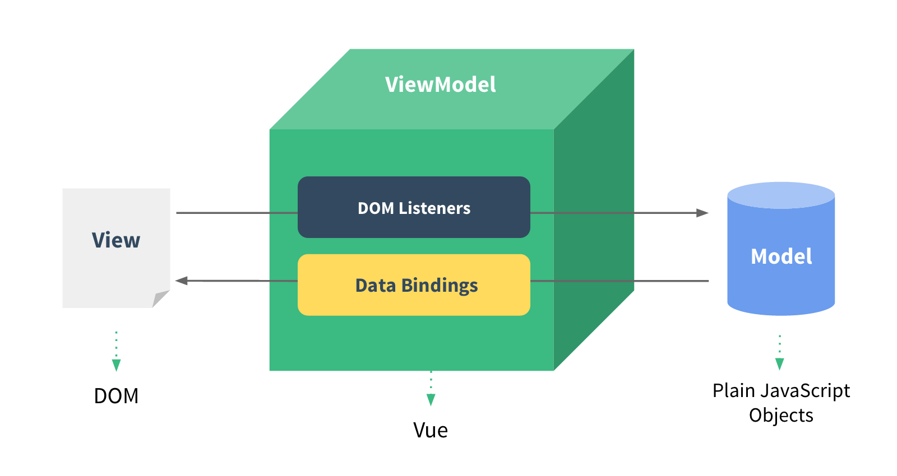

## Problem

#### vue

- v-for 中的 key
- Vue 组件生命周期（父子组件的情况）
- Vue 组件通讯
- 组件渲染和更新过程
- v-model 实现原理

- 基于 vue 实现一个购物车

#### webpack

- 前端代码为什么要构建和打包
- module chunk bundle
- loader plugin 区别
- webpack 实现懒加载
- webpack 常见性能优化
- babel-runtime 和 babel-polyfill 区别

#### 思路

- 框架的使用（基本使用，高级特性，插件）
- 框架的原理（基本原理，热门技术，全面性）
- 框架实际开发（组件结构，数据结构）

## Vue 基本

#### 插值

```html
{{message}} // 插值
{{flag?'y':'n'}}
<p :id="a"></p>
<p v-html="h"></p> // 使用 v-html 会覆盖子元素,xss
```

#### computed & watch

- computed 有缓存机制，data 不变不会重新计算

  ```vue
  computed: {
  	a(){
  		return this.a
  	}
  }
  ```

- watch 如何深度监听

  ```javascript
  watch: {
  	name(oldVal, val){
  		console.log('name',oldVal.val) //值类型可以这样用
  	}
      man:{
          handler(oldVal, val){
              console.log('object', oldVal,val)//引用类型，oldVal无效
          },
          deep: true // 深度监听
      }
  },
  ```

- watch 监听引用类型，拿不到 oldVal

#### class & style

```vue
<template>
	<div>
        <p :class="{black:isBlack,yellow:isyellow}"></p>
        <p :class="[black, yellow]"></p>
        <p :class="sytleData"></p>
    </div>
</template>
<script>
export default{
    data(){
        return {
            isBlack:true,
            isyellow:true,
            black:'black',
            yellow:'yellow',
            sytleData:{
				fontSize:'20px', // 驼峰方式
                color:'red',
            }
        }
    }
}
</script>
```

#### v-if & v-show

v-if 不会在 dom 中渲染。

当切换频繁时用 v-show，不频繁用 v-if

#### 循环渲染

- v-for

- :key 的重要性。:key 不能乱写。与业务相关联。

- v-for 与 v-if 不推荐共用

  v-for 比 v-if 优先级高，每个 for 循环都会执行一次 v-if。当只想渲染部分节点是可以这样用。但是想要跳过循环的话就不推荐了。

#### 事件

- event 参数

  ```js
  <button @click="click1"></button>
  <button @click="click2(1,'abc',$event)"></button>
  methods:{
  	click1(event){
  		console.log(event,event.target,event.currentTarget) 
          // 1、event是原生event
          // 2、事件被挂载到当前元素
  	}
  }
  ```

- 事件修饰符

  和按键修饰符

#### 表单

```vue
<div>
    <p>输入框</p>
    <input type='text' v-model.trim="name"/> // 去空格
    <input type='text' v-model.lazy="name"/> // 防抖
    <input type='text' v-model.number="name"/> // 数字
    <p>多行文本</p>
    <textarea v-model="desc"></textarea>
    <p>复选框</p>
    <input type="checkbox" v-model="checked"/> //布尔值
    <p>多个复选框</p>
    <input type="checkbox" id="1" value="1" v-model="checkedList"/>
    <input type="checkbox" id="2" value="2" v-model="checkedList"/>
    <input type="checkbox" id="3" value="3" v-model="checkedList"/>
    <p>单选框</p>
    <input type="radio" id="1" value="1" v-model="x"/>
    <input type="radio" id="2" value="2" v-model="x"/>
    <p>下拉列表，单选</p>
    <select v-model="selected">
        <option disabled value="">请选择</option>
        <option>a</option>
        <option>b</option>
        <option>c</option>
    </select>
    <p>下拉列表，多选</p>
    <select v-model="selectedList" mutiple>
        <option disabled value="">请选择</option>
        <option>a</option>
        <option>b</option>
        <option>c</option>
    </select>
</div>
```

#### vue 组件使用

- data 用 return：每个 vue 组件其实相当于一个 class，每次使用都是实例化的过程，这用的话每个组件的 data 都是一个独立的拷贝，否则会导致修改一个组件其他所有组件都跟着变化

- props 和$emit

  父子组件通讯的一种方式

  - props 是父组件给子组件传值，在子组件里定义

    ```vue
    <blog-post title="My journey with Vue"></blog-post>
    <blog-post :title="tabledata.title"></blog-post>	动态 v-bind
    ```

  - $emit 是子组件触发事件

    ```vue
    子组件里定义一个 enlarge-text 事件，当这个组件被点击就触发这个事件
    <button v-on:click="$emit('enlarge-text')">Enlarge text</button>
    父组件里可以定义这个事件触发后执行的函数
    <blog-post v-on:enlarge-text="doSomething()"></blog-post>
    ```

- 组件间通讯 - 自定义事件

  非父子组件间通讯

  ```javascript
  event.$emit('event1', this.title) // 触发自定义事件，第二个参数是传给监听的值
  event.$on('event1', this.logout) // 监听自定义事件，第二个是回调函数
  // 这里的 event 其实就只是一个 vue 实例，vue 实例包含了自定义事件
  // 绑定时没有用箭头函数，为了方便在 beforeDestory 里解绑自定义事件，防止内存泄露
  ```

- 子组件修改父组件的值

  1. 通过 $emit 来触发父组件中定义的事件，然后父组件事件触发，再触发父组件中定义的回调函数。

  2. 通过父组件中定义 .sync

     ```javascript
     # 父组件
     <myComponent :show.sync='valueChild'>
     # 子组件
     this.$emit('update:show', false) // 后面的参数是新的值
     ```

- 单向数据流：父级 prop 的更新会向下流动到子组件中，每次父级组件发生更新时，子组件中所有的 prop 都将会刷新为最新的值。但是反过来则不行。这样会防止从子组件意外变更父级组件的状态，从而导致你的应用的数据流向难以理解。

#### 组件生命周期（单组件）

- 挂载

  - beforeCreated
  - created
  - beforeMount
  - mounted
  - beforeUpdate
  - update
  - beforeDestory
  - destory

  create 是 vue 实例初始化完成，mounted 是网页已经渲染完了

- 更新

- 销毁

  - beforeDestory 

    解除自定义事件的绑定，销毁任务与事件

#### 生命周期（父子组件）

- created	初始化实例-由外向内
- mount	  渲染-由内向外
- update     更新-由外向内
- destory

#### Vue 高级特性

- 自定义 v-model
- $nextTick
- slot
- 动态、异步组件
- keep-alive
- mixin

#### 自定义 v-model

```vue
<template>
    <!-- 例如：vue 颜色选择 -->
    <input type="text"
        :value="text1"
        @input="$emit('change1', $event.target.value)"
    >
    <!--
        1. 上面的 input 使用了 :value 而不是 v-model
        2. 上面的 change1 和 model.event1 要对应起来
        3. text1 属性对应起来
    -->
</template>

<script>
export default {
    model: {
        prop: 'text1', // 对应 props text1
        event: 'change1'
    },
    props: {
        text1: String,
        default() {
            return ''
        }
    }
}
</script>
```

#### $nextTick

- vue 为异步渲染框架
- 异步渲染意味着 data 改变后，DOM 不会立即渲染
- $nextTick 会在 DOM 渲染之后触发，以获取最新的 DOM 节点
- 异步页面渲染时会把 data 的渲染做整合，多次 data 修改只会渲染一次。
- 在 html 中定义 ref="a" 后可以在 js 中使用 this.$refs.a 来获取 DOM 元素

```javascript
this.$nextTick(()=>{console.log(a.childNodes.length)})
```

#### slot

- 基本

  ```html
  // 父组件
  <SlotDemo :url="xxx.com">
      {{website.title}}
  </SlotDemo>
  // 子组件
  <template>
      <a :href="url">
          <slot>
              默认内容，即父组件没设置内容时，这里显示
          </slot>
      </a>
  </template>
  ```

- 作用域插槽

  为了让父组件使用插槽时能够访问子组件中的数据

  ```html
  // 父组件
  <ScopedSlotDemo :url="website.url">
      <template v-slot="slotProps">
          {{slotProps.slotData.title}}
      </template>
  </ScopedSlotDemo>
  // 子组件
  <template>
      <a :href="url">
          <slot :slotData="website">
              {{website.subTitle}} 
          </slot>
      </a>
  </template>
  ```

- 具名插槽

  ```html
  // 子
  <slot name="xxx"></slot>
  // 父
  <template v-slot:xxx></template>
  ```

#### 动态组件

一个页面所需要的组件是不确定的，组件顺序也不确定。

例如新闻页面等。

```vue
<component :is="componentName"/>
```

#### 异步组件

比较大的组件使用异步加载。

- import() 函数

```javascript
export default{    
	components: {
		FormDemo: () => import('../BaseUse/FormDemo'),
    },
}
```

#### 缓存组件

用 keep-alive 包裹，例如 tab 切换的场景

```html
<keep-alive>
	<componentName />
</keep-alive>
```

#### 组件抽离公共逻辑 - mixin

- mixin 的问题，vue3 中解决。

1. 变量来源不明确，可读性差
2. 多 mixin 造成命名冲突 - 属性不好糅合
3. mixin 和组件会出现多对多关系，复杂度上升。

#### vuex

优点：

- 相对于 localstorage 不用做额外的转换
- 能够触发响应式的更新
- 修改数据用的可预测的逻辑
- 非父子组件的消息传递

缺点：

- 刷新后数据丢失，可用 vuex-persistedstate(基于 localstorage)

刷新后若是在 created 里发送请求，可能会出现 token 还没有从 localstorage 中得到的情况，可用 watch + immediate 中发送请求来解决

基本

- state 数据结构设计
- getters
- action - 异步操作必须在 action 完成
- mutation

api

- dispatch
- commit
- mapState
- mapGetters
- mapActions
- mapMutations

#### vue-router

路由模式：

- hash			 如 /#/user/1			
- H5 history   如 /user/1		需要 server 支持

路由配置：

- 动态路由

  ```javascript
  const router = new VueRouter({
      routes: [
          { path:'/user/:id', component: User}
      ]
  })
  ```
  
- 懒加载

  ```javascript
  routes:[
      {
          path:'/',
          component: () => import(
          	'./../components/...'
          )
      },
      {
          path: '/feedback',
          component: () => import(
          	'./../components/...'
          )
      }
  ]
  ```

# Vue 原理

- 组件化
- 响应式
- vdom 与 diff
- 模板编译
- 渲染过程
- 前端路由

## 组件化

#### 传统组件化与 Vue React 区别

- 传统组件还是静态渲染，更新需要通过 DOM 操作
- 数据驱动视图 - Vue-MVVM
  - 修改数据就能修改视图，降低复杂度
  - 专注于数据，不用再操作 DOM



## Vue 响应式

- 组件 data 数据一旦变化，立刻触发视图更新
- 数据驱动视图的基础
- Vue 原理的基础

#### 核心 API - Object.defineProperty

```javascript
const data ={}
Object.defineProperty(data,"name",{
    get: function(){
        console.log('get')
        return name
    },
    set: function(value){
    	console.log('set')
    	name = value
	}
})
data.name = "1" ------- set
data.name ------------- get
```

- 监听数组

  主要思路是重新定义原型，但是要注意不能全局替换。

  ```javascript
  // 重新定义数组原型
  const oldArrayProperty = Array.prototype
  // 创建新对象，原型指向 oldArrayProperty ，再扩展新的方法不会影响原型
  const arrProto = Object.create(oldArrayProperty);
  ['push', 'pop', 'shift', 'unshift', 'splice'].forEach(methodName => {
      arrProto[methodName] = function () {
          updateView() // 触发视图更新
          oldArrayProperty[methodName].call(this, ...arguments)
          // Array.prototype.push.call(this, ...arguments)
      }
  })
  ```

- 复杂对象监听

  ```javascript
  // 重新定义属性，监听起来
  function defineReactive(target, key, value) {
      // 深度监听
      observer(value)
      // 核心 API
      Object.defineProperty(target, key, {
          get() {
              return value
          },
          set(newValue) {
              if (newValue !== value) {
                  // 深度监听
                  observer(newValue)
                  // 注意，value 一直在闭包中，此处设置完之后，再 get 时也是会获取最新的值
                  value = newValue
                  // 触发更新视图
                  updateView()
              }
          }
      })
  }
  
  // 监听对象属性
  function observer(target) {
      if (typeof target !== 'object' || target === null) {
          // 不是对象或数组
          return target
      }
      if (Array.isArray(target)) {
          target.__proto__ = arrProto
      }
      // 重新定义各个属性（for in 也可以遍历数组）
      for (let key in target) {
          defineReactive(target, key, target[key])
      }
  }
  ```

#### defineProperty 缺点

- 深度监听需要多层递归到底，**一次性**计算量大
- 无法监听新增或删除属性(Vue.set    Vue.delete)
- 无法原生监听数组，需要进行特殊的处理

##  虚拟DOM(VDOM) & diff

- vdom 是实现 vue 和 react 的基础
- diff 算法是 vdom 的核心。
- Vue3.0 重写了 vdom，优化了性能
- 但是 vdom 基本理念不变

#### 背景

- DOM 操作消耗性能很大
- 以前使用 jQuery 来自行控制 DOM 操作，来优化性能
- Vue 和 React 是数据驱动视图，如何有效控制 DOM 操作

#### VDOM

- 复杂度提高后，减少计算次数比较困难
- 尽可能把 DOM 转移为 JS 计算，因为 JS 计算的速度快
- vdom - 用 JS 模拟 DOM 结构，计算出最小的变更，再操作 DOM

```html
<div id="div1" class="container">
    <p>vdom</p>
    <ul style="font-size:20px">
        <li>a</li>
    </ul>
</div>
```

```javascript
{
    tag:'div',
    props: {
        id: 'div1',
        className: 'container'
    },
    children:[
        {
            tag: 'p',
            props:'vdom',
        },
        {
            tag: 'ul',
            props:{
                style: 'font-size:20px'
            },
            children:[
                {
                    tag: 'li',
                    props: 'a'
                }
            ]
        }
    ]
}
```

#### snabbdom

- 是一个 vdom 库
- vue 和 react 参考的它实现的 vdom 和 diff

#### diff 算法

- 将 vdom 与 dom 进行对比，找出最小更新的算法。
- 例如 key 就是 diff 算法的体现。
- diff 是对比的意思，并不特指。

#### 时间复杂度优化

- 直接的 tree diff 时间复杂度为 O(n3)
- 只比较同一层级，不跨级比较
- tag 不相同就删掉重建，不再深度比较
- tag 与 key 都相同，认为是相同节点，不再深度比较(都不传 key，也是key相等，一般在直接定义的情况) 


#### snabbdom源码

- vnode 结构：sel, data, children, text, elm, key

- h 函数：输入一个 selector、data、children。返回 vnode 结构

- patch：传入 两个 vnode 或一个 dom 一个 vnode   
  - 第一个参数不是 vnode 而是 DOM 元素, 创建一个新的 vnode 关联到这个 dom
  - 相同的 vnode(tag 和 key 都相同)，执行 patchvnode 来对比
  - 不同的 vnode，直接删除重建，不再对比
  - 都不传 key 也是相同 vnode。 undefined = undefined

- patchVnode：对比两个 vnode
  - 先把旧的 vnode 的 elm 赋给新的
  - 若新的 vnode.text 为 undefinded (一般意味着有 children)
    - 若新旧都有 children，执行 updatechildren
    - 若只有新 children 有，则清空旧 elm 的 text，添加 children。
    - 若只有旧 children 有，则移除旧 children
    - 若新旧既没有 text 也没有 children，就把 elm 的 text 设为空
  - 如果没有 children，新的 text 与旧 text 不相等。如果旧的 vnode 有 children 则移除旧 children，给 elm 设置新的 text

- updateChildren：两者都有 children 时进行对比
  - 两头都有指针，双指针循环，两个指针重合结束
  - 用 sameVnode 判断是否一个节点
  - 四种情况：开始与开始，结束与结束，开始与结束，结束与开始 节点的 key 和 tag 相同
  - 命中一种情况就执行 patchVnode
  - 若四种都未命中
    - 拿新节点的 key 来对比所有旧的 key，看是否有相同的
    - 都没对应上就插入，重建
    - 对应上了，就判断 sel(tag) 是否相等
    - sel 相等就执行 patchVnode，否就再插入(新建)

- key的重要性

  当新节点跟旧节点`头尾交叉对比`没有结果时，会根据新节点的key去对比旧节点数组中的key，从而找到相应旧节点（这里对应的是一个key => index 的map映射）。如果没找到就认为是一个新增节点。而如果没有key，那么就会采用遍历查找的方式去找到对应的旧节点。一种一个map映射，另一种是遍历查找。相比而言。map映射的速度更快。

## 模板编译

组件渲染和更新过程

- html 是标签语言，不是图灵完备的语言，只有 js 才能实现判断、循环。
- vue 模板被转换为了 js 代码，即模板编译

#### js 的 with 语法

打破了作用域规则，可读性差

```javascript
const obj = {a:1, b:2}
with(obj){
    console.log(a) // 当做 obj 的属性来查找
    console.log(b) // 当做 obj 的属性来查找
    console.log(c) // obj 中没有
}
```

#### 模板编译过程

- vue template complier 将模板编译为 render 函数
- 执行 render 函数生成 vnode
- 基于 vnode 再执行 patch 和 diff

#### 使用 render 代替 template

```vue
<div>
        <header>
          <h1>I'm a template!</h1>
        </header>
        <p v-if="message">{{ message }}</p>
        <p v-else>No message.</p>
</div>
function anonymous(
) {
  with(this){return _c('div',[_m(0),(message)?_c('p'，[_v(_s(message))]):_c('p',[_v("No message.")])])}
}
```

## 组件渲染/更新的完整过程

- 模板编译：将模板编译为 render 函数，再执行 render 函数生成 vnode
- vdom：通过 patch 渲染。patch(elm, vnode)，patch(oldvnode, newvnode)
- 响应式：监听 date 的属性。getter，setter

#### 初次渲染过程

1. 解析模板为 render 函数(一般在开发环境下完成，vue-cli 的 vue-loader)
2. 触发响应式，监听 data 属性 getter setter
3. 执行 render 函数，生成 vnode，patch(elem,vnode)

#### 更新过程

1. 修改 data，触发 setter(在 getter 中已经被监听)
2. 重新执行 render 函数，生成 newVnode
3. patch


#### 异步渲染

- 汇总 data 的渲染，一次更新视图
- 减少 dom 操作
- $nexttick

## 前端路由原理

- 稍微复杂的单页面应用都需要路由

####  路由模式

- hash
- H5 history

#### hash 特点

- hash 变化会触发网页跳转，浏览器的前进、后退
- hash 变化不会刷新页面
- hash 不会提交到 server 端

```javascript
// 获取 hash
location.hash
// 修改 hash
location.href = '#/user'
// 监听 hash 变化
window.onhashchange = (event) =>{
    event.oldURL
    event.newURL
}
```

#### H5 history

- 用 url 规范的路由，但跳转时不刷新页面
- history.pushState
- window.onpopstate

#### H5 模式

- github.com/xxx	刷新界面
- github.com/xxx/10    前端跳转，不刷新界面
- github.com/xxx/10/yy    前端跳转，不刷新界面
- H5 需要后端配合，服务端需要设置所有 path 都返回 index

```javascript
// 改变路由
const state = {name:'page1'}
history.pushState(state, '', 'page1')
// 监听路由前进后退
window.onpopstate = (event) =>{
	console.log(event.state, location.pathname)
}
```


