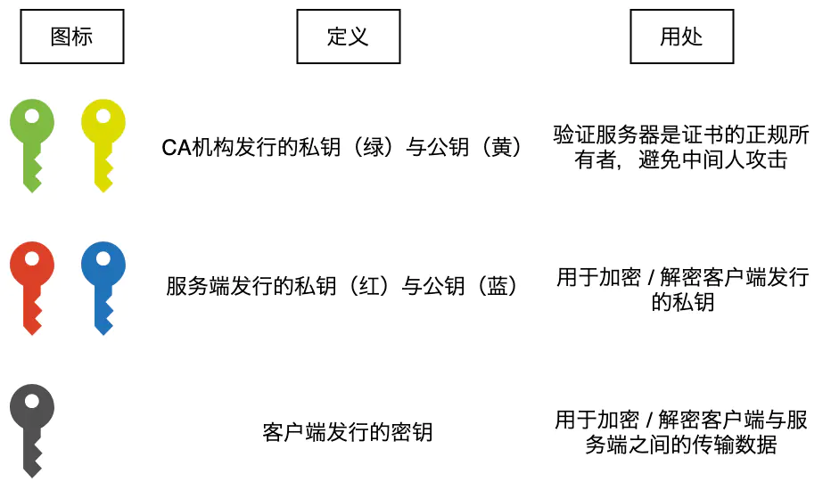
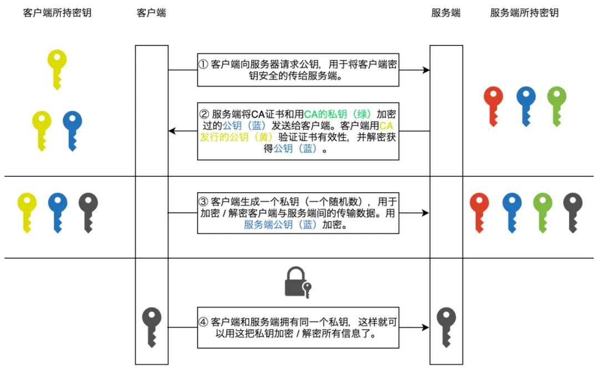

# JS

#### Object 和 map 的区别？

它们都是用来存储键值对的

- map 默认不包含任何键，但 object 有原型，所以键名可能冲突
- map 的键是任意类型(函数、对象等)，object 的键必须是 string 或 symbol
- map 是有序的，遍历时以插入的顺序，object 是无序的
- map 有 size 属性，可以获取键值对个数，object 需要手动计算
- map 是可迭代的，object 需要先获取键再迭代
- map 在频繁增删键值对的场景下有优化，速度更快

set 类似于数组，但它的值是唯一的，在 set 中 NaN 也等于 NaN，所以不会重复。

#### 说一说 es6 的主要新特性？

- 参数默认值 fn(a=5,b=6) 且只有在传入 undefined 时才继续用默认值。例如传入 null 则参数是 null。
- 模板字符串
- 解构赋值 const {a,b} = obj
- 扩展运算符 ...
- let const
- promise
- async await
- symbol

#### 实现一个符合 Promise A+ 的 promise

。。。

#### 实现 Promise.all .race .once .allSettled

#### 箭头函数和普通函数的区别

箭头函数是 ES6 语法，是用来简化函数的定义的。

- this 指向
  - 箭头函数的 this 是外部的 this，且是静态 this，不会改变，call bind 也不会改变它的this
  - 普通函数的 this 指向调用它的对象
- 箭头函数不能作为构造函数
- 箭头函数没有 arguments 可以用 (...rest)

```javascript
const obj = {
    getThis(){
        return ()=>{
            console.log(this === obj)
        }
    }
}
// babel 转译
var obj = {
    getThis: function getThis(){
		var _this = this
        return function(){
            console.log(_this === obj)
        }
    }
}
```

#### var let const 区别

- var 是 ES5 语法，let const 是 ES6 语法
- 变量提升, 用 var 定义的变量会首先全部赋成 undefined
- var let 为变量，const 为常量，不可修改
- let const 有**块级作用域**，var没有

冻结 const

- 使用 object.freeze() 但是只是浅冻结
- defineproperty 可以定义 writeable 为 false,但是要每个都定义,并且对新增的值无效

#### 堆和栈的区别

- 栈主要用来存储值类型，堆用来存储引用类型
- 垃圾清除时栈中的值用完就清除了，但是堆中需要进行标记清除，没有变量引用它时才能清除。

#### 手写 Instanceof

```javascript
const instanceOf = (left, right)=>{
  let { __proto__: p } = left;
  while (p) {
    if (p === right.prototype) return true;
    p = p.__proto__;
  }
  return false;
}
```

#### 手写 new

```javascript
const objectFactory = (...rest)=>{
    const obj = new Object()
    const constructor = rest.shift()
    obj.__proto__ = constructor.prototype
    const res = constructor.apply(obj, rest) // constructor 有返回值的话直接返回这个返回值
    return typeof res === 'object'?res??obj:obj
}
```

#### 深度比较

```javascript
const isObject = (obj)=>{
    return typeof obj ==='object'&& obj!==null
}
const isEqual = (obj1,obj2)=>{
    if(!isObject(obj1)||!isObject(obj2)) return obj1===obj2
    obj1 === obj2 && return true
    const obj1Keys = Object.keys(obj1)
    const obj2Keys = Object.keys(obj2)
    if(obj1Keys.length !== obj2Keys.length) return false
    for(let key in obj1){
        if(!isEqual(obj1[key],obj2[key])){
            return false
        }
    }
    return true
}
```

#### 深拷贝

```javascript
function deepClone(obj, cache = new WeakMap()){
    if(typeof obj !=='object'|| obj === null){
        return obj
    }
    if(cache.get(obj)) return cache.get(obj) // 防止循环引用
    if(obj instanceof Date) return new Date(obj)
    if(obj instanceof RegExp) return new RegExp(obj)
    let res
    cache.set(obj,res) // 防止循环引用
    if(obj instanceof Array){
        res = []
    }else{
        res = {}
    }
    for(let key in obj){
        res[key] = deepClone(obj[key],cache)
    }
    return res
}
```

#### 手写发布订阅模式

```javascript
class EventBus{
    constructor(){
        this.events = {}
        this.onceFnMap = {}
    }
    on(type, callback){
        if(!this.events[type]){
            this.events[type] = [callback]
        }else{
            this.events[type].push(callback)
        }
    }
    off(type,callback){
        if(this.onceFnMap[callback]){
            this.off(type,this.onceFnMap[callback])
            this.onceFnMap[callback] = null
        }
        if(!this.events[type]){
            return
        }
        this.events[type] = this.events[type].filter(item=>{
            return item !== callback
        })
    }
    emit(type,...args){
        if(!this.events[type]){
            return
        }
        this.events[type].forEach(callback=>{
            callback.apply(this,args)
        })
    }
    once(type, callback){
        function fn(){
            callback()
            this.off(type,fn)
        }
        this.on(type,fn)
        this.onceFnMap[callback] = fn
    }
}
```

#### 发布订阅模式和观察者模式有什么区别

相同点：都是某个事件触发后通知观察/订阅者,然后执行操作。

不同点：

- 观察者模式维护一个事件及其观察者，发布订阅维护多个事件及其观察者
- 观察者模式直接触发通知，发布订阅模式先通知事件中心，事件中心再通知订阅者

#### 原型、原型链、作用域、作用域链

#### 闭包的原理

一个函数和其环境捆绑在一起组合而成形成一个闭包

- 定义函数不会创建闭包, 创建/执行函数才会创建闭包
- 闭包和该函数在同一个上下文中
- 闭包包含该作用域下的所有变量/引用

对于全局作用域中创建的函数来说也有闭包，但是这个闭包在全局作用域创建，所以并不重要。对于函数中创建函数的行为，返回的函数可以访问不属于全局作用域的变量，但是它们只在闭包中。

**变量**：在函数定义的地方而不是函数执行的地方

循环中的闭包

```javascript
// var 会将 i 提升到函数作用域的顶部,这就表示 setTimeout 中创建的函数的闭包中都是同一个 i,那么到最后 i =10,所有的回调里获取的也都是10.
const fn = () =>{
    for(var i=0;i<10;i++){
    	setTimeout(()=>{
            console.log(i)
        })
	}
}
// let 存在于 for 的块级作用域中,那么每次 setTimeout 回调函数创建的闭包就是当时的 i,就可以正确获取到 i 的值.
const fn = () =>{
    for(let i=0;i<10;i++){
    	setTimeout(()=>{
            console.log(i)
        })
	}
}
```

#### 为什么要区分宏任务/微任务

首先宏任务和微任务是不同的地方控制的，微任务主要是 js 引擎控制的，宏任务主要是浏览器控制。

并且异步需要区分优先级，优先级高的任务应该先执行，那么就可以把这些任务放到微任务里，而且微任务的执行在渲染前，就可以先执行一些对渲染有影响的操作。

#### 前端测试

使用 jest 进行测试


# React

#### setState 同步 or 异步

这里可以提一下 React18 的 autoBatching 新特性，并且可以用 flushSync 来使其同步。

#### React fiber 原理

#### React 合成事件

- 所有事件都挂载到 document 上
- react 中的事件不是原生事件，是 SyntheticEvent 合成事件对象，模拟原生事件

**React 事件触发步骤**

- 某个 dom 元素触发事件
- 事件冒泡至 document
- React 通过 SyntheticEvent 将事件实例化成统一的合成事件
- 派发事件
  - 通过 target 找到触发事件的元素
  - 通过这个元素找到它的组件
  - 找到这个组件中绑定了事件的处理函数
  - 把合成事件的 event 传递给处理函数

**为什么使用合成事件**

- 更好的兼容性和跨平台
- 挂载到 document 上，减少内存消耗，避免频繁解绑，提升可复用性
- 方便事件的统一管理(事务机制)

**如何在异步中调用合成事件**

因为要复用事件对象，所以每次事件处理函数调用完后对象会被置空，异步操作就访问不到了。可以用 e.persist()

#### useMemo useCallback 区别

注意点:

- useCallback 只有在子组件包裹了 React.memo 时才有效

#### useEffect 与 useLayoutEffect 区别

useEffect 过程：

1. state 更新
2. react 全量更新(diff 等操作)
3. dom 更新
4. 清除上一次的 effect
5. 运行这一次的 effect

useLayoutEffect 是在 diff 后 dom 更新前，会阻塞页面渲染。

#### useEffect、useMemo、useCallback 如何做依赖收集

#### React Hooks 和 class 的区别

**非 UI 逻辑的复用**

Class 组件的解决方法要么复制一遍逻辑，要么用 Hoc，但 Hoc 很容易导致包装地狱。

HOOK，使用自定义 Hook 可以很轻松地复用逻辑。

**生命周期中的重复逻辑**

class组件中，很多时候要在 didMount，didUpdate 中重复同样的逻辑。

useEffect 消除了生命周期的概念，也不用做这种重复劳动。

**函数组件捕获了渲染所用的值。**

React 虽然是以 immutable 为基础，但是 class 组件的一个问题就是它的 this 是不变的。虽然 this.state 和 this.props 是 immutable，但是 this 始终是这个 this，这也就导致了不管在 class 组件的哪个地方，你获取的永远是最新的，过于新的 props。

Function 组件的特点就是接收的 props 和本身的 state 都是真正的不可变的，利用闭包的特性，这个 state 和 props 都是渲染时那一刻的值，这种方式是更符合直觉的。但会引来新的问题就是闭包陷阱的问题。

#### Hook、Hoc、Render Props 的区别

- Hoc
  - 不影响组件内部
  - 无法清晰地看出组件的 props
  - 多层包裹会导致 props 命名冲突
- Render Props
  - 只能在传进来的 render 函数中才能访问变量
  - 嵌套地狱
- 自定义 Hook
  - 可以重命名且没有命名冲突
  - 可以像 state 一样使用数据，而不是只能在 render 里
  - 不会产生嵌套
  - 逻辑更直观，心智负担小

#### 如何解决闭包陷阱

- setState 传入回调
- 使用 useReducer
- 使用 useRef

#### React 和 Vue 的区别

# 网络

#### HTTPS

在 https 之前，http 协议的传输都是明文的，所以传输内容很容易泄露。所以需要加密措施。

**对称加密**：加密和解密用的同一个密钥。

**非对称加密**：有私钥和公钥，可以用公钥加密私钥解密，或者私钥加密公钥解密。

只用对称加密：通信之前需要一方吧公钥发给另一方，这个过程可以被截获。

只用非对称加密：例如服务端有公钥和私钥，把公钥发给客户端，黑客截取了公钥。那么黑客也可以解密服务端发送过来的内容。但是无法解密客户端发给服务端的，因为没有私钥。





**为什么 HTTPS 是可靠的**?

因为客户端会验证 CA 证书，所以黑客无法冒充服务端。而 CA 证书需要大量验证步骤，防止了黑客获取证书的可能性。

#### HTTP缓存

**Cache-Control 值：**

- max-age
- no-cache 不用本地缓存，可能用服务端的缓存
- no-store 不用本地缓存，也不用服务端的缓存措施
- private 只允许最终用户缓存
- public 代理服务器也可以缓存


#### TCP 三次握手

其实主要是为了确认双方的发送和接收能力，再加上怕有些传输比较慢的报文过了很久才到服务端，然后直接建立连接了，损失性能。

1. 客户端发送请求: 服务端:客户端能发 自己能收 客户端:无
2. 服务端发回来: 服务端:客户端能发 自己能收 客户端: 自己能收/发 服务端能收/发
3. 客户端再发: 服务端: 客户端能收/发 自己能收/发 客户端:自己能收/发 服务端能收/发

#### TCP 四次挥手

主要是为了确认双方都没啥要发的了。要四次的原因是客户端请求关闭但是可以继续接收，服务端也未必全发完了，所以 ack 和 FIN 是分开发的，确认可以关闭了再发 fin

1. 客户端发送 FIN，服务端收到并进入等待关闭的状态
2. 服务端发回一个 ACK 表示收到了你的 FIN
3. 服务端再发一个 FIN 表示同意关闭连接，客户端收到后等 2MSL 后关闭连接，因为怕客户端发送的 ack 服务端没收到
4. 客户端发送 ACK 表示确认

#### 输入一个 url 到网页渲染的过程

1. 查找域名对应的 ip 地址

   1. 先查询本地 DNS 缓存，例如 host 文件
   2. 向本地 DNS 服务器进行递归查找(返回最终 ip)
   3. 本地 DNS 服务器若没有，则向根服务器进行迭代查询(返回服务器 ip，然后向这个服务器查询)
   4. 获取 ip，并存储到缓存中

2. 浏览器向服务器发送请求

   - 重定向

     - seo
     - 换域名

   - nginx 反代

     当访问量太大，一台服务器无法快速响应，就会部署服务集群，由 nginx 来做一层反向代理，来做负载均衡。

     反向代理即服务端的代理，由nginx来判断把请求发送给哪个服务器，最后返回给客户端。

3. 返回 HTTP 响应

4. HTML 渲染

   1. HTML 自上而下加载，遇到外部资源会进行异步请求
   2. 首先解析 HTML 为 DOM Tree，然后解析 CSS 为 Render Tree
   3. 解析完成后开始渲染。
   4. 遇到 script 或者 js，会暂停 HTML 解析，执行 js。(因为 JS 会修改 DOM，可能导致之后的解析没有必要。)

5. 如果是 SSR

   1. 服务端首先发送请求获取 data
   2. 所有 data 获取完后，将页面拼接为 HTML，同时将 js boundle 发送给客户端
   3. 客户端接收到 HTML 后渲染出页面，此时网页还不可交互
   4. 客户端接收到 js bundle，进行脱水操作，将 js 代码以及 Vue 或 React 逻辑对应到真实 DOM 上
   5. 之后的操作和逻辑与 SPA 应用一样


#### onload 和 DOMContentLoaded

DomContentLoaded 是在 HTML 加载完，HTML 中的 js 和 script 中的 js 的同步代码执行完后触发

onload 是在页面全部资源都加载完才触发

#### HTTP2 的区别

- 增加了一个二进制分帧层，在不改变 http1.1 原有协议内容的情况下提升性能。首部信息被封装到 header 帧，body 被分装到 data 帧
- 多路复用，http2 可以并行发送多个请求，提高带宽利用率
- 数据优先级
- 服务端推送，服务端可以向客户端提供请求以外的内容。例如请求一个页面，服务端可以吧 js 和 css 一起发过来。
- 头部压缩，例如 2 可以表示是 get 方法

#### 浏览器并发请求有数量限制?

一般浏览器最多和同一个 host 建立 6 个 TCP 连接

#### 建立一个TCP连接后，是否会断开？什么条件下会断开？

默认是长连接，不会断开，只有设置 connection:close 才会断开。

#### 如何优化大量请求

接口合并、http2、缓存

#### Cookie 是什么，和 JWT 有什么区别

- cookie 是一个浏览器存储的，在每次发送 http 请求都会带的数据

- cookie 是通过服务端生成 session，http 头中设置 set-cookie 来存储的

- 会话 cookie

  网页关闭就删除

- 永久性 cookie

  网页关闭不删除,但是可以设置特定日期删除

- JWT

  - 用来身份验证
  - 包括加密签名
  - 服务端不用再存储 session,jwt 只存在客户端
  - 不用担心 cookie 的跨域问题

#### CSRF 攻击

流程

- 用户登录了 a.com 并保留了信息
- 用户被诱导访问 b.com
- b.com 向 a.com 发送一个请求,并且携带了 a.com 的 cookie

策略

- 同源

  但是对于页面的请求应该放行，所以不能在页面请求中放操作的指令

- csrf token 

  每一次请求都带上一个 token，

#### XSS 攻击

攻击者在网站注入恶意脚本，运行并窃取信息。很多时候是因为 js 的问题，很容易执行 url 参数里的 js 代码。

策略

1. 后端方面
   - 纯前端渲染，即前后端分离，后端不用再拼接 html 给前端
   - HTML 转义(后端)
2. 前端方面
   - 插入 innerHtml、将 url 参数传给例如 eval() setTimeout() 时要小心
   - 使用扫描工具找潜在的 xss 漏洞

# CSS

#### display opacity visible 有什么区别

display:

- DOM 结构：浏览器不会渲染 display 属性为 none 的元素，不占据空间
- 事件监听：无法进行 DOM 事件监听；
- 性能：动态改变此属性时会引起重排，性能较差；
- 继承：不会被子元素继承，毕竟子类也不会被渲染；
- transition 不支持

opacity:

- DOM 结构：透明度为 100%，元素隐藏，占据空间；
- 事件监听：可以进行 DOM 事件监听；
- 性 能：提升为合成层，不会触发重绘，性能较高；
- 继 承：会被子元素继承,且子元素并不能通过 opacity: 1 来取消隐藏；
- transition 支持

visibility: hidden;

- DOM 结构：元素被隐藏，但是会被渲染不会消失，占据空间；
- 事件监听：无法进行 DOM 事件监听；
- 性 能：动态改变此属性时会引起重绘，性能较高；
- 继 承：会被子元素继承，子元素可以通过设置 visibility: visible; 来取消隐藏；
- transition：visibility 会立即显示，隐藏时会延时

#### CSS 单行截断

```css
overflow: hidden;
text-overflow: ellipsis; #文本溢出显示方式，和overflow hidden结合使用
white-space: nowrap; #不换行
```

还有 js 的解决方案

#### transition transform translate

transition:

只是用来设置元素某一属性的改变怎么过度。

transform：

设置元素的样式，例如 scale 移动 旋转

translate：

是 transform 的一个属性，控制元素移动

#### BFC

可以看做是形成了一个独立的容器,容器内部的元素不会影响外部元素的布局

**形成 BFC 条件**

- body
- 绝对定位 absolute fixed
- overflow (hidden auto scroll 都可以)
- display (flex inline-block)

**作用**

- 阻止 margin 折叠
- 包含浮动元素

#### 盒模型

浏览器在布局的时候会把每一个元素都描述为一个盒子。

盒模型分为两种分别是 content-box 和 border-box

- content-box 宽度: 内容的宽度 高度:内容的高度
- border-box 宽度: border + padding + 内容 高度: border + padding + 内容

#### 伪元素和伪类的区别

最大区别是伪元素创建了一个文档树之外的元素，伪类没有。

伪类常用于元素的状态描述（这些状态无+法用 dom 描述）。

伪元素用于创建一些不在文档树里的内容并添加样式。

常见伪类：

- 状态
  - hover、visited、focus、active
- 选择器
  - not、first-child、last-child
- 表单
  - checked、disabled、read-only

常见伪元素

- ::before、::after

  在元素前后插入内容

- :first-line、:first-letter

  匹配第一行，因为想要做到实际上是给第一行单独加了个 span，所以其实是创建了一个元素

- ::selection

  匹配用户选择的部分

#### 响应式布局

- 媒体查询

#### flex 和 grid 的区别

- flex 本质是一维布局,grid 是二维布局

#### 如何画一个 0.5 px 的线

原因：很多高清屏幕是用多个物理像素来渲染一个像素的，所以画 0.5 px 可能对应 1px 的物理像素，看起来更细。

**方案**：

1. 直接设置 0.5px

   不同浏览器表现不一样，chrome 直接四舍五入了。

2. transform: scaleY(0.5)

   会变虚 需要加上 transform-origin: 50% 100%;

   相当于让它在最上面忘下渲染 1px，而不是从中间渲染。

3. box-shadow 设置 0.5px

   只在 chrome 中还行

4. svg

   svg 对应物理像素

#### 画一个比例盒子

主要原理: padding-top 是根据父元素的宽度计算的

```less
.box{
    width: 100px;
    .scale{
        width: 100%;
        height:0;
    	padding-bottom: 75%;
    	background-color: black;
        .content{
            width:100%;
            height:100%;
            position:absolute;
        }
    }
}
```

#### 画一个扇形

利用 css 的 clip

```less
.box{
    width:200px;
    height:200px;
    position:relative;
    .container{
        width:100%;
        height:100%;
        position:absolute; // 只有absolute rect才生效
        clip: rect(0,200,200,100);
        .content{
            width: 100%;
            height: 100%;
            border-radius: 50%;
            transform: rotate(20deg); // 改变扇形的角度
            position: absolute;
            clip: rect(0px, 100px, 200px, 0);
        }
    }
}
```

# 小程序

#### Taro 是如何实现跨端的

跨端框架原理：

- compile time：编译时

  在编译打包的过程中，将代码转译为小程序代码。Taro1/2

  问题:使用限制大，容易出现 BUG

- runtime：运行时

  在小程序中运行 React/Vue 然后通过适配层，渲染到小程序上。Taro3

**Taro1/2**:

本质：将 react 代码转化成小程序代码。是假 React。

流程:

- 使用 babel 将 Taro 代码解析成 AST
- 对 AST 进行修改、转换
- 生成对应代码

问题：

- 需要适配 JSX 各种写法，且限制很多。由于 js 过于灵活。
- 没有 SourceMap
- React 新特性需要手动对接
- 前端生态没法直接用。

**Taro3:**

本质：实现了一个 Renderer，将 React Vdom patch 到不同平台对应的元素。

# 浏览器

#### defer 与 async 的区别

背景: HTML 中遇到 script 标签会暂停解析，先获取 js 脚本，执行完脚本后恢复解析

**async**

遇到 async 脚本，先异步发送请求，当请求完成后立即暂停解析，执行完 js 代码后恢复解析。

- 先完成的先解析，顺序不可控
- 有可能会阻塞 HTML 解析

**defer**

遇到 defer 脚本， 先异步发送请求，当请求完成后，会等待 HTML 解析完后执行。

- 不会阻塞 HTML 解析
- 执行的顺序按照 defer 的顺序来

# 手写题

#### 查询 URL 参数

decodeURIComponent 和 decodeURI 区别是后者是对整个 url 解码,一般都是用前者。

escape 主要是用来编码字符串。

```javascript
const queryToObj  = (url)=>{
    const search = url.split('?')[1]
    const reg = new RegExp(`(^|&|\?)${name}=([^&]*)(&|$)`,'i')
    // (^|&|\?) 表示开头是 字符串开头 或者 & 或者 ?
    // ${name}= 是模板字符串加上 = 号
    // ([^&]*)  [^&] 表示除了 & 之外所有,*表示一次或多次
    // (&|$)    表示字符串结束或者遇到 &
    // i        表示匹配大小写
    const res = search.match(reg)
    if(res == null) return null
    return decodeURIComponent(res[2]) // 解析中文或者对象
}
```

#### 防抖

```js
const debounce = (fn,delay=500)=>{
    let timer = null
    return (...args)=>{
        if(timer){
            clearTimeout(timer)
        }
        timer = setTimeout(()=>{
            fn.apply(this,args)
        },delay)
    }
}
```

#### 节流

```javascript
const throttle = (fn, delay=500){
    let timer = null
    return (...args)=>{
        if(timer){
            return
        }
        timer = setTimeout(()=>{
            fn.apply(this,args)
            timer = null
        },delay)
    }
}
```

#### Promise 并发控制

```javascript
const limitPromises = (promises=[],limit = 2)=>{
  return new Promise((resolve, reject)=>{
    const len = promises.length
    let current = 0
    const start = ()=>{
      const promise = promises[current]
      if(promise){
        promise().finally(()=>{
          if(current === len){
            resolve()
          }else{
            start()
          }
        })
        current += 1
      }
    }
    for(let i=0;i<limit;i+=1){
      start()
    }
  })
}
```

#### 数组拍平(指定层级)

#### 函数柯里化

```javascript
const curry = (fn)=>{
  const isEnough = (...args)=>{
    if(args.length === fn.length) return fn(...args)
    return (...arg) => isEnough(...args,...arg)
  }
  return isEnough
}
```

